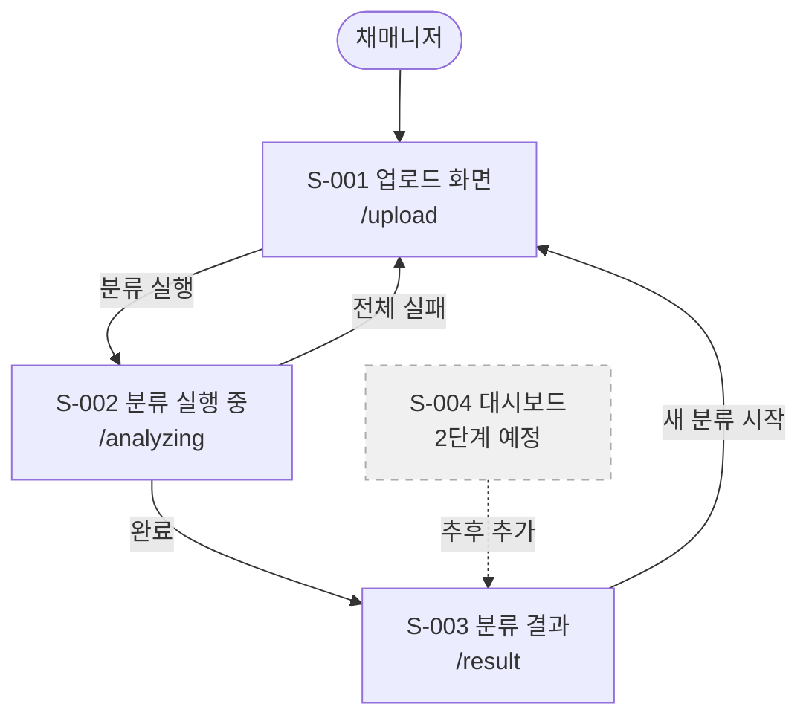
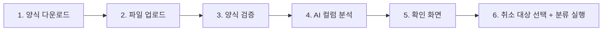

# 취소사유분석기 FRD

> 작성일: 2026-05-21 · 버전: v2.0 (제품 방향 확정 반영)
> PRD: `PRD-취소사유분석기-v2.md`

---

## 1. 한 문단 요약

이 FRD는 취소사유분석기 1단계 화면 3개(S-001 업로드, S-002 분류 실행 중, S-003 분류 결과)가 어떻게 보이고 어떻게 동작하는지를 정의한다. 가장 큰 변화는 S-001 업로드 화면이다. 기존의 수동 컬럼 매핑 드롭다운과 프리셋 저장·불러오기가 완전히 제거되고, 대신 "분석용 엑셀 양식 다운로드 → 파일 업로드 → 양식 자동 검증 → AI 전체 컬럼 분석 → 사용자 확인 → 취소 대상 선택" 흐름으로 재설계된다. S-004 대시보드 화면은 2단계로 이동한다.

실제 원본 데이터 분석 결과에서 확인된 "최종결과 컬럼 기반 취소 대상 선택" 방식은 이번 설계에서도 유지된다. 이로써 합격자·보류 등 분류 불필요 행이 자동으로 제외된다.

---

## 2. 화면 지도

채매니저는 항상 업로드 화면에서 시작한다. 업로드 → 분류 실행 중 → 분류 결과 세 화면이 단방향으로 연결된다. 이전 단계를 거쳐야만 다음 화면에 진입할 수 있다.

### 2.1 전체 흐름



### 2.2 화면 분류

| 화면 | 1단계 포함 여부 | 이유 |
|---|---|---|
| S-001 업로드 | ✅ 포함 | 도구 사용의 시작점 |
| S-002 분류 실행 중 | ✅ 포함 | AI 분류 진행 표시 |
| S-003 분류 결과 | ✅ 포함 | 검토·수정·출력 |
| S-004 대시보드 | ❌ 2단계 | 1단계 안정화 후 추가 |

---

## 3. 1단계 MVP 범위

1단계의 핵심은 "고정 양식으로 업로드 → AI 분류 → 검토 → 노션 출력" 단일 흐름이다. 이 흐름이 막힘없이 동작해야 서비스 가치가 전달된다.

| 항목 | 내용 |
|---|---|
| 1단계 화면 수 | 3개 (S-001, S-002, S-003) |
| 1단계 총 기능 | 아래 기능 목록 참조 |
| 개발 예상 기간 (1인) | 4주 이내 |

### 1단계 기능 목록

**S-001 업로드 화면**
- F-001: 분석용 엑셀 양식 다운로드 버튼
- F-002: 파일 끌어다 놓기 또는 클릭 업로드
- F-003: 파일 형식 검증 (xlsx, xls만 허용. 다른 형식이면 안내 메시지)
- F-004: 양식 자동 검증 (필수 컬럼 존재 확인)
- F-005: 필수 컬럼 없음 에러 처리 (분류 실행 버튼 비활성 + 안내 메시지 + 양식 다운로드 유도)
- F-006: 컬럼명 변경 감지 안내 (예: "인터뷰내용 컬럼이 없습니다. '면담내용' 컬럼이 비슷합니다")
- F-007: AI 전체 컬럼 자동 분석 (양식 검증 통과 후 자동 실행)
- F-008: AI 컬럼 분석 결과 확인 화면 ("AI가 이렇게 이해했습니다" 표시)
- F-009: 확인 화면에서 "이 내용으로 진행" / "다시 분석" 버튼
- F-010: 최종결과 컬럼 값 체크박스 목록 표시
- F-011: 취소 대상 건수 실시간 표시 ("분류 대상 N건")
- F-012: 기수명 입력란 (선택 사항)
- F-013: 분류 실행 버튼 (취소 대상 1건 이상 선택 시 활성화)

**S-002 분류 실행 중 화면**
- F-014: 진행 카운터 표시 ("N건 완료 / M건 전체")
- F-015: 진행 막대(프로그레스 바)
- F-016: 단계 표시 (분류 중 → 인사이트 생성 중)
- F-017: 분류 중 이탈 경고 팝업 (화면을 나가려 할 때 "분류가 중단됩니다. 계속하시겠습니까?")
- F-018: 일부 실패 시 "N건 검토 필요로 처리됨, 계속 진행 중" 안내
- F-019: 전체 실패 시 재시도 버튼 표시

**S-003 분류 결과 화면**
- F-020: 상단 요약 바 ("전체 N건 | 검토 필요 M건 | 완료 K건")
- F-021: 전체 분류 결과 테이블 (행별로 1차 원인·2차 행동·세부 태그·타 과정명·판단 근거·검토 필요 여부 표시)
- F-022: 검토 필요 행 노란색 표시
- F-023: 검토 완료 행 초록색 표시
- F-024: 행 클릭 시 원문(인터뷰 내용·특이사항) 사이드 패널 표시
- F-025: 1차 원인·2차 행동·세부 태그·검토 필요 여부 인라인 수정 (셀 클릭 시 편집 가능)
- F-026: 수정 내용 자동 저장
- F-027: 검토 필요 → 완료 처리 (값 변경 시 행 색상 초록색으로 전환)
- F-028: 노션 형식 복사 버튼 (검토 필요 행이 모두 완료됐을 때 활성화)
- F-029: 노션 형식 복사 클릭 시 마크다운 테이블 + 인사이트 요약을 클립보드에 복사
- F-030: 신규 카테고리 목록 표시 (이번 분류에서 AI가 새로 만든 카테고리 목록)
- F-031: 인사이트 요약 표시 (AI 자동 생성, "참고용" 안내 문구 포함)
- F-032: "새 분류 시작" 버튼 (업로드 화면으로 이동)

---

## 4. 화면별 상세 정의

### S-001 업로드 화면

#### 4.1 화면 흐름

업로드 화면은 6단계 순서로 진행된다. 각 단계는 이전 단계가 완료돼야 다음 단계가 활성화된다.



#### 4.2 1단계: 양식 다운로드

- 화면 상단에 "분석용 엑셀 양식 다운로드" 버튼이 항상 표시된다
- 버튼을 누르면 필수 컬럼이 포함된 고정 xlsx 파일이 다운로드된다
- 양식 안내 문구: "이 양식에 취소자 데이터를 입력한 후 업로드해 주세요"

**양식의 필수 컬럼 목록**

| 컬럼명 | 설명 | 필수 여부 |
|---|---|---|
| 인터뷰내용 | 취소자와 나눈 면담 내용 | 필수 |
| 특이사항 | 담당자가 기록한 특이사항·메모 | 필수 |
| 최종결과 | 신청 결과 (취소·합격·보류 등) | 필수 |
| 유입경로 | 광고·검색·지인 소개 등 | 선택 (2단계 대시보드에서 활용) |
| 진행단계 | 인터뷰 전·후·등록 등 | 선택 (2단계 대시보드에서 활용) |

#### 4.3 2단계: 파일 업로드

- 파일을 끌어다 놓거나 클릭으로 선택
- 허용 형식: xlsx, xls
- 업로드 성공 시: 파일명 + 총 행 수 표시 ("취소자_3기.xlsx | 총 52행")
- 허용 형식 외 파일: "xlsx 또는 xls 파일만 업로드할 수 있습니다" 에러 메시지

#### 4.4 3단계: 양식 자동 검증

파일 업로드 직후 자동으로 실행된다. 사용자가 별도로 버튼을 누를 필요 없다.

| 상황 | 화면 표시 | 다음 단계 진행 여부 |
|---|---|---|
| 필수 컬럼 모두 존재 | "양식 확인 완료. AI 컬럼 분석을 시작합니다" | ✅ 자동 진행 |
| 필수 컬럼 없음 | "필수 컬럼 'XXX'이 없습니다. 양식을 다운로드해 사용해 주세요" + 양식 다운로드 버튼 | ❌ 분류 불가 |
| 컬럼명 약간 다름 | "'인터뷰내용' 컬럼이 없습니다. '면담내용' 컬럼이 비슷합니다. 양식을 수정하거나 다시 확인해 주세요" | ❌ 분류 불가 |

#### 4.5 4단계: AI 전체 컬럼 분석

양식 검증을 통과하면 GPT-5.5가 파일 전체 컬럼을 자동으로 읽고 분석한다.

- "AI가 파일을 분석하고 있습니다..." 로딩 표시
- 완료 후 확인 화면으로 자동 전환

#### 4.6 5단계: AI 컬럼 분석 결과 확인 화면

GPT-5.5가 파악한 결과를 표로 보여준다.

| AI가 찾은 컬럼 | AI의 이해 내용 |
|---|---|
| 인터뷰내용 | 면담 내용으로 이해했습니다 |
| 특이사항 | 담당자 메모로 이해했습니다 |
| 최종결과 | 신청 결과로 이해했습니다 |
| (기타 컬럼들) | ... |

- "이 내용으로 진행" 버튼: 사용자가 승인하면 다음 단계로 이동
- "다시 분석" 버튼: AI 분석을 처음부터 다시 실행
- 사용자가 승인하지 않으면 분류 실행 버튼이 활성화되지 않음

#### 4.7 6단계: 취소 대상 선택 + 분류 실행

AI 분석 승인 후 표시된다.

- 최종결과 컬럼에서 발견된 값 목록이 체크박스로 표시됨
  - 예: ☑ 취소 ☑ 취소처리 ☑ 환불 ☐ 합격 ☐ 보류
- 체크한 값에 해당하는 행 수가 실시간으로 표시됨: "분류 대상 44건"
- 기수명 입력란 (선택 사항): 결과 화면 상단에 표시될 기수명
- "분류 실행" 버튼: 1건 이상 선택 시 활성화
- 버튼 클릭 시 S-002로 이동

#### 4.8 오류·빈 상태

| 상황 | 화면 표시 |
|---|---|
| 아무 파일도 없는 초기 상태 | "분석용 양식을 다운로드하고 데이터를 입력한 후 업로드해 주세요" 안내 |
| AI 컬럼 분석 실패 | "AI 분석 중 오류가 발생했습니다. 다시 시도해 주세요" + 재시도 버튼 |
| 취소 대상 0건 선택 | 분류 실행 버튼 비활성 + "취소 관련 항목을 하나 이상 선택해 주세요" 안내 |

---

### S-002 분류 실행 중 화면

#### 4.9 화면 구성

분류 실행 중 화면은 진행 상황을 실시간으로 보여준다.

- 상단: 현재 단계 표시 ("취소 사유 분류 중" → "인사이트 요약 생성 중")
- 중앙: 진행 막대 (전체 중 몇 건 완료됐는지)
- 카운터: "N건 완료 / M건 전체"
- 하단 안내: "화면을 닫거나 이동하면 분류가 중단됩니다"

#### 4.10 분류 중 이탈 경고

채매니저가 다른 탭으로 이동하거나 브라우저를 닫으려 할 때 팝업이 표시된다.

- 팝업 메시지: "분류가 진행 중입니다. 지금 이탈하면 분류가 중단됩니다. 계속 진행하시겠습니까?"
- 버튼: "계속 분류" (팝업 닫기) / "나가기" (이탈 확인)

#### 4.11 오류 처리

| 상황 | 처리 방식 |
|---|---|
| 인터뷰내용·특이사항 둘 다 비어있는 행 | "정보 부족 — 검토 필요"로 자동 태깅하고 계속 진행 |
| 특정 3건 묶음 분류 실패 | 해당 3건 "검토 필요"로 태깅 + "N건 검토 필요로 처리됨, 계속 진행 중" 안내 표시 |
| 전체 분류 실패 | "분류를 완료하지 못했습니다. 다시 시도해 주세요" + 재시도 버튼 + 업로드 화면으로 돌아가기 버튼 |

---

### S-003 분류 결과 화면

#### 4.12 화면 구성

```
[상단 요약 바]
전체 N건  |  검토 필요 M건  |  완료 K건

[인사이트 요약] (AI 자동 생성, 참고용)
주요 취소 사유는 OO이며, ...

[분류 결과 테이블]
행번호 | 인터뷰 내용(요약) | 1차 원인 | 2차 행동 | 세부 태그 | 검토 필요
-----------------------------------------------------------------------
1      | 내일배움카드 이슈로... | 카드 이슈 | 타 과정 신청 | 카드 | ✅검토 필요
2      | 일정이 맞지 않아...   | 일정 충돌 | 추후 재신청 | 일정 | ✓완료

[신규 카테고리 목록]
이번 분류에서 새로 만들어진 카테고리: OOO (3건), XXX (1건)

[노션 형식 복사 버튼]
```

#### 4.13 검토 필요 행 처리

- 노란 배경: 검토 필요 상태
- 초록 배경: 완료 상태
- 행 클릭 시 오른쪽에 원문 패널이 열림 (인터뷰 내용 전문 + 특이사항 전문)
- 1차 원인·2차 행동·세부 태그 셀 클릭 → 직접 편집 가능
- 검토 필요 값을 "완료"로 바꾸면 행이 초록색으로 전환
- 수정 내용은 저장 버튼 없이 자동으로 저장됨

#### 4.14 노션 형식 복사

- 조건: 검토 필요 행이 모두 완료 처리됐을 때 버튼 활성화
- 복사 내용:
  - 분류 결과 마크다운 테이블 (1차 원인·2차 행동·세부 태그·검토 여부)
  - 인사이트 요약 단락
- 복사 완료 시: "복사되었습니다" 토스트 메시지

#### 4.15 오류·빈 상태

| 상황 | 화면 표시 |
|---|---|
| 세션 없이 직접 URL 접근 | 업로드 화면으로 자동 이동 + "먼저 파일을 업로드해 주세요" 안내 |
| 분류 결과 없음 (예외 상황) | "분류 결과가 없습니다. 다시 시도해 주세요" + 업로드 화면으로 이동 버튼 |
| 저장 실패 | "수정 내용을 저장하지 못했습니다. 잠시 후 다시 시도해 주세요" 토스트 메시지 |

---

## 5. 삭제된 기능 (기존 FRD 대비)

| 기존 기능 | 삭제/이동 이유 | 대체 방법 |
|---|---|---|
| 컬럼 매핑 드롭다운 (수동 선택) | 새 방향에서 제거 | 고정 양식 + AI 자동 분석으로 대체 |
| 프리셋 저장 버튼 | 새 방향에서 제거 | 양식 고정으로 불필요 |
| 프리셋 불러오기 드롭다운 | 새 방향에서 제거 | 양식 고정으로 불필요 |
| 프리셋 불일치 경고 | 새 방향에서 제거 | 양식 검증으로 대체 |
| S-004 대시보드 | 2단계로 이동 | 1단계 안정화 후 추가 |

---

## 6. 2단계 예정 기능

| 기능 | 설명 |
|---|---|
| S-004 대시보드 | 전체·유입경로별·진행 단계별 탭 3개, 취소 사유 TOP5 차트 등 |
| 회원가입·로그인 | 팀원도 접근 가능하도록 |
| CSV 다운로드 | 분류 결과를 파일로 저장 |

---

## 수정 이유 요약

1. S-001 업로드 화면에서 수동 컬럼 매핑 드롭다운과 프리셋 기능을 완전히 삭제하고, 고정 양식 다운로드 → 양식 검증 → AI 자동 컬럼 분석 → 사용자 확인 → 취소 대상 선택 흐름으로 재설계
2. S-004 대시보드 화면을 1단계 포함 → 2단계로 이동 (PRD 변경 반영)
3. AI 모델명을 GPT-5.5로 통일 (서비스 정의서·PRD·TRD와 충돌 해소)
4. 필수 컬럼 없을 때 분류 실행 차단 및 컬럼명 변경 감지 안내 신규 추가
5. AI 컬럼 분석 결과를 사용자가 반드시 확인·승인해야 분류가 시작되는 단계 추가 (자동 실행 방지)
