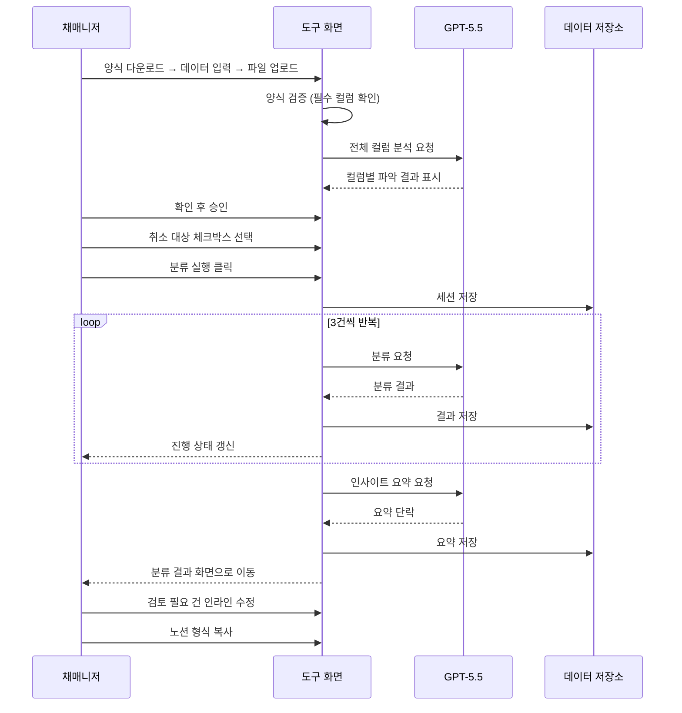
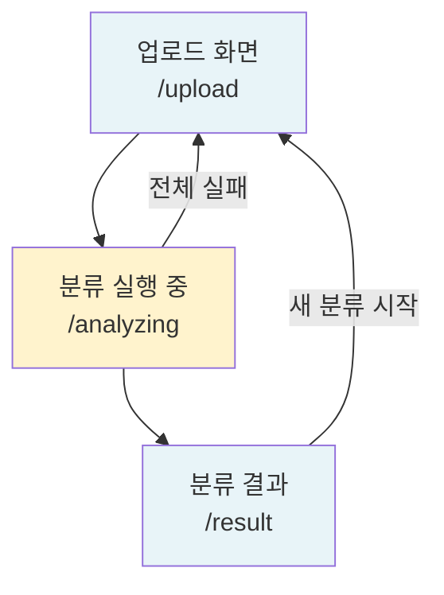
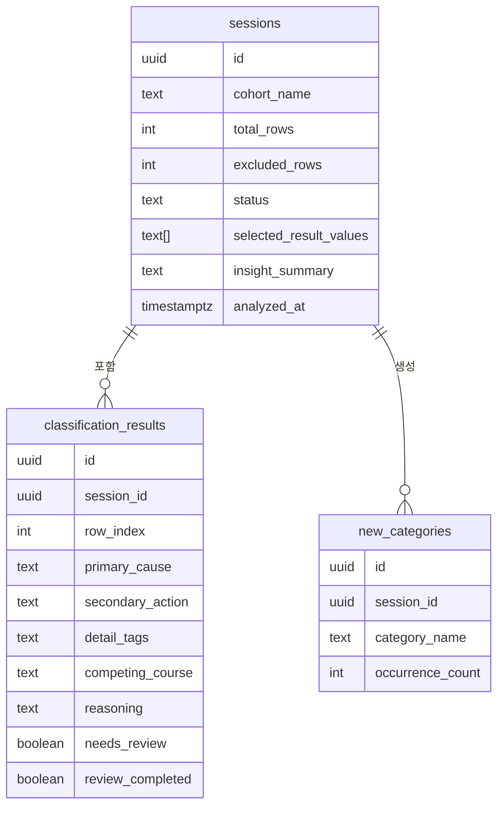

# 취소사유분석기 PRD

> 작성일: 2026-05-21 · 버전: v2.0 (제품 방향 확정 반영)
> 작성자: 최원재 · 회사: 아이티커넥트㈜

---

## 1. 한 문단 요약

취소사유분석기는 교육과정 운영 담당자가 기수 종료 후 반복 수행하는 취소자 분류 업무를 자동화하는 사내 웹 도구다. 사용자는 도구에서 제공하는 분석용 엑셀 양식에 취소자 데이터를 입력하고 업로드하면, 도구가 양식을 자동으로 검증하고 GPT-5.5가 전체 컬럼을 스스로 파악한다. 사용자가 AI의 컬럼 파악 결과를 한 번 확인하고 승인하면 분류가 시작된다. 컬럼을 손으로 지정하거나 프리셋을 저장할 필요가 없다.

1단계 범위는 세 개 화면(업로드 → 분류 실행 중 → 분류 결과)으로 구성되며, 분류 완료 후 노션 형식 복사와 인사이트 요약을 바로 사용할 수 있다. 대시보드 3뷰(전체·유입경로별·진행 단계별)는 2단계에서 추가한다. 기술적 핵심 위험은 GPT-5.5 분류 정확도와 서버 실행 시간 제약으로, 3건 묶음 호출 방식과 Supabase 영구 저장으로 대응한다.

---

## 2. 왜 만드는가

### 2.1 현재 어떻게 일하고 있나

기수가 종료되면 담당자는 신청·취소 데이터 엑셀을 전달받아 분석을 시작한다. 엑셀 필터와 찾기 기능으로 키워드를 걸러낸 뒤, 불명확한 건은 인터뷰 내용 열을 하나씩 읽으며 직접 분류한다. 기수당 취소자가 40~60명이면 이 과정만으로 2~3시간이 소요된다. 더불어 기수마다 엑셀 컬럼 구성이 조금씩 다르면 어느 컬럼이 인터뷰 내용인지 다시 확인해야 한다.

### 2.2 무엇이 답답한가

키워드 필터의 결정적 한계는 복합 사유를 잘라버린다는 점이다. "내일배움카드 발급이 늦어져 타 과정을 신청하려고 함"이라는 문장에서 키워드 필터는 한 가지만 잡는다. 실제로 필요한 판단은 1차 원인(내일배움카드 이슈)과 2차 행동(타 과정 신청)을 동시에 추출하는 것인데, 이 판단은 문장 전체를 읽어야만 가능하다. 또한 담당자마다 분류 기준이 달라 기수 간 비교가 어렵다.

### 2.3 우리가 어떻게 바꾸는가

취소사유분석기는 고정된 분석용 엑셀 양식을 제공한다. 담당자는 이 양식에 취소자 데이터를 입력하고 업로드하면 된다. GPT-5.5가 파일 전체 컬럼을 읽고 어떤 컬럼이 무슨 의미인지 스스로 파악하며, 그 결과를 화면에 보여준다. 담당자가 확인하고 승인하면 분류가 시작된다. 3건씩 묶어 처리하므로 속도도 빠르고 오류가 생겨도 해당 건만 "검토 필요"로 표시한 뒤 나머지를 계속 처리한다. 인터뷰·특이사항이 없는 행은 자동으로 제외된다.

---

## 3. 누가 쓰는가

이 도구를 주로 사용하는 사람은 교육과정 운영사에서 마케팅과 모집을 담당하는 직원이다.

### 3.1 핵심 사용자

| 항목 | 내용 |
|---|---|
| 이름 | 채매니저 |
| 역할 | 교육과정 운영사, 마케팅·모집 총괄 담당 |
| 컴퓨터 사용 수준 | 노션·구글 워크스페이스·엑셀 능숙. 코드 안 씀 |
| 주로 사용하는 기기 | 노트북 |
| 사용 상황 | 기수 종료 후 취소자 엑셀을 받아 분석. 회의 전 빠르게 결과를 뽑아야 하는 시간 압박 상황 |
| 원하는 것 | 15분 안에 결과, 팀에 데이터 기반으로 공유 |

### 3.2 1단계에서 제외되는 사용자

- 외부 교육기관 담당자 (v1은 사내 도구)
- 스마트폰으로 분류를 실행하려는 사용자 (노트북 전용)
- 분류 기준을 직접 수정하려는 사용자 (1단계는 고정 기준)

---

## 4. 사용 시나리오

### 시나리오 1: 기수 종료 후 첫 분류 (기본 흐름)

기수가 끝나고 취소자 엑셀이 도착했다. 채매니저는 도구에 접속해 "분석용 엑셀 양식 다운로드" 버튼을 누른다. 다운로드된 양식에 운영팀에서 받은 취소자 데이터를 붙여넣고 저장한다. 도구로 돌아와 파일을 끌어다 놓으면 "양식 확인 중..." 메시지 후 "양식 일치. 총 52행"이 표시된다.

곧바로 AI가 전체 컬럼을 분석해 "인터뷰내용 컬럼: 수강 취소 면담 내용으로 이해했습니다", "최종결과 컬럼: 신청 결과로 이해했습니다" 같은 결과를 보여준다. 채매니저가 확인하고 "이 내용으로 진행" 버튼을 누른다.

다음으로 최종결과 값 목록이 나타나고, 취소 관련 값(취소·취소처리·환불 등)에 체크한다. "분류 대상 44건"이 표시되고 "분류 실행" 버튼을 누른다.

분류 실행 중 화면에서 진행 상태가 표시되고("18건 완료 / 44건"), 완료되면 분류 결과 화면으로 이동한다. "전체 44건 | 검토 필요 6건"이 상단에 표시되고, 노란색으로 표시된 6건을 인라인 수정한다. 모두 완료 후 "노션 형식 복사" 버튼을 눌러 팀 문서에 붙여넣는다.

### 시나리오 2: 다음 기수 — 동일 양식으로 빠르게 시작

다음 기수 데이터가 도착했다. 채매니저는 동일한 양식에 새 데이터를 붙여넣고 업로드한다. 양식이 일치하면 AI가 이전과 동일하게 컬럼을 파악하고 확인 화면을 보여준다. 취소 대상 체크박스를 선택하고 분류 실행. 컬럼 설정에 걸리는 시간이 없어 2분 안에 분류를 시작할 수 있다.

### 시나리오 3: 양식이 맞지 않는 경우

운영팀에서 양식 없이 직접 만든 엑셀을 보내왔다. 채매니저가 이 파일을 업로드하면 "필수 컬럼 '인터뷰내용'이 없습니다. 분석용 양식을 먼저 다운로드해 사용해 주세요." 메시지가 표시되고 분류 실행 버튼이 비활성화된다. 채매니저는 양식을 다운로드해 데이터를 다시 정리한 후 재업로드한다.

---

## 5. 무엇을 만드는가

### 5.1 화면 구조

1단계는 3개 화면으로 구성된다. 대시보드는 2단계에서 추가한다.

### 5.2 핵심 기능

#### 5.2.1 엑셀 양식 관리 + 업로드

업로드 화면은 아래 순서로 진행된다.

**1단계 — 양식 다운로드**: 화면 상단에 "분석용 엑셀 양식 다운로드" 버튼이 있다. 이 양식은 필수 컬럼(인터뷰내용, 특이사항, 최종결과 등)이 미리 정의된 고정 파일이다.

**2단계 — 파일 업로드**: 파일을 끌어다 놓거나 클릭으로 선택한다. xlsx, xls 파일만 허용된다. 업로드 후 파일명과 총 행 수가 표시된다.

**3단계 — 양식 자동 검증**: 필수 컬럼이 모두 있는지 자동으로 확인한다. 필수 컬럼이 없으면 에러 메시지를 보여주고 분류 실행을 막는다. 컬럼명이 약간 바뀐 경우(예: "인터뷰내용" → "면담내용") 에는 사용자가 이해할 수 있는 안내 메시지를 보여준다.

**4단계 — AI 컬럼 분석**: GPT-5.5가 파일 전체 컬럼을 읽고 각 컬럼을 어떤 의미로 이해했는지 화면에 표시한다. 예: "인터뷰내용 컬럼 → 면담 내용으로 이해", "최종결과 컬럼 → 신청 결과로 이해".

**5단계 — 확인 화면**: AI의 파악 결과를 보여주고 사용자가 "이 내용으로 진행" 또는 "다시 분석"을 선택한다. 사용자가 승인해야 다음 단계로 넘어간다.

**6단계 — 취소 대상 선택**: 최종결과 컬럼에서 감지된 값 목록을 체크박스로 보여준다. 취소 관련 값을 선택하면 "분류 대상 N건"이 표시되고 분류 실행 버튼이 활성화된다. 기수명 입력란(선택 사항)에 기수를 입력할 수 있다.

#### 5.2.2 GPT-5.5 분류

분류 엔진은 이 도구의 핵심이다. 선택된 취소 대상 행을 3건씩 묶어 GPT-5.5에 전달하고, 각 행에 대해 6개 항목을 동시에 추출한다: 1차 원인, 2차 행동, 세부 태그, 타 과정명, 판단 근거, 검토 필요 여부.

기존 항목으로 설명되지 않는 사유가 나오면 GPT-5.5가 신규 카테고리를 자동으로 만들어 분류한다. 인터뷰 내용과 특이사항 둘 다 비어있는 행은 "정보 부족 — 검토 필요"로 자동 처리한다. API 오류로 일부 행이 실패하면 해당 행을 "검토 필요"로 태깅하고 나머지를 계속 처리한다. 전체가 실패하면 재시도 버튼을 보여준다.

분류가 모두 완료된 후 GPT-5.5가 전체 결과를 읽고 주요 패턴을 한 단락으로 요약한다.

#### 5.2.3 분류 결과 + 노션 출력

결과 화면 상단에 "전체 N건 | 검토 필요 M건"이 표시된다. 검토 필요 행은 노란색, 완료된 행은 초록색으로 표시된다.

각 행의 1차 원인·2차 행동·세부 태그·검토 필요 여부 셀은 클릭하면 바로 수정할 수 있다. 행을 클릭하면 오른쪽에 원문(인터뷰 내용·특이사항) 패널이 열린다. 수정 내용은 자동으로 저장된다.

"검토 필요" 표시를 "완료"로 바꾸면 행이 초록색으로 바뀐다. 검토 필요 행이 모두 완료되면 "노션 형식 복사" 버튼이 활성화된다. 버튼을 누르면 분류 테이블 + 인사이트 요약이 마크다운 형식으로 클립보드에 복사된다.

결과 화면 하단에는 이번 분류에서 새로 만들어진 카테고리 목록이 표시된다.

### 5.3 데이터 구조 (개요)

세션이 분류 실행의 단위이고, 각 세션 안에 행별 분류 결과와 신규 카테고리가 속한다.

---

## 6. 어떻게 만드는가

### 6.1 기술 구조 요약

화면과 서버 기능이 하나의 Next.js 프로젝트 안에 공존하며, Vercel에 배포한다. 별도 서버를 운영하지 않는다.

| 영역 | 선택 |
|---|---|
| 플랫폼 | Next.js 14 (화면과 서버 기능 통합) |
| 화면 | React + Tailwind CSS (스타일) |
| 서버 기능 | Next.js API Route (GPT·DB 호출 전담) |
| 데이터 저장소 | Supabase (PostgreSQL 기반 무료 DB) |
| 인증 | 없음 (v1은 채매니저 단독 사용) |
| 파일 파싱 | SheetJS (브라우저에서 엑셀 읽기) |
| 양식 파일 제공 | 정적 파일 서빙 (서버에 고정 파일 보관) |
| 배포 | Vercel 무료 플랜 |

### 6.2 작동 방식

채매니저가 분류 실행을 누르면 화면이 3건씩 순서대로 서버에 분류를 요청한다. 서버는 GPT-5.5를 호출하고 결과를 Supabase에 저장한 뒤 화면에 진행 상태를 전달한다. GPT-5.5 API 키는 서버에서만 사용하며 화면(브라우저)에 절대 노출되지 않는다.

### 6.3 보안

OpenAI API 키와 데이터베이스 접속 정보는 서버 환경 변수에 저장하며 화면에 노출되지 않는다. GPT-5.5 호출은 서버에서만 실행된다. v1은 채매니저 단독 사용이므로 별도 로그인 기능은 없다.

### 6.4 사용하는 외부 서비스

| 서비스 | 용도 | 비용 |
|---|---|---|
| OpenAI GPT-5.5 | 컬럼 분석·취소 사유 분류·인사이트 요약 | 기수당 $0.50 이하 (추정) |
| Supabase | 분류 결과 영구 저장 | 무료 플랜 ($0) |
| Vercel | 서비스 배포·운영 | 무료 플랜 ($0) |
| SheetJS | 엑셀 파일 읽기 (무료 라이브러리) | $0 |

n8n, Make, Zapier 등 외부 자동화 서비스는 사용하지 않는다. 모든 처리는 서비스 안에서 직접 수행한다.

---

## 7. 일정·자원·성공 지표

### 7.1 일정과 자원

| 항목 | 내용 |
|---|---|
| 개발 기간 | 4주 이내 (1인 바이브코딩) |
| 필요 인력 | 1인 (대표 직접 구현) |
| GPT-5.5 비용 | 기수당 $0.50 이하 (추정) |
| 인프라 월 비용 | $0 (Vercel + Supabase 무료 플랜) |

### 7.2 성공 지표

| 지표 | 목표 | 측정 방법 |
|---|---|---|
| 분류 완료 시간 | 50건 기준 5분 이내 | 업로드 ~ 결과 화면 도달까지 실측 |
| AI 분류 수정률 | 15% 이하 | 전체 건수 대비 인라인 수정 건수 비율 |
| 분석 시간 단축 | 기존 대비 60% 이상 감소 | 이전 기수 수동 분석 시간 vs 도구 사용 시간 |
| 컬럼 설정 시간 | 0분 | 확인 화면 승인까지 시간 실측 |

### 7.3 주요 위험

- **AI 분류 정확도 미달**: 짧거나 모호한 메모에서 오분류가 빈번하면 검토 필요 건수 증가 → 첫 기수 전 샘플 20건으로 테스트 후 출시
- **서버 실행 시간 초과**: GPT-5.5 응답이 느릴 경우 → 3건 묶음으로 제한, 초과 시 해당 건 자동으로 검토 필요 처리
- **양식 비준수 파일 업로드**: 운영팀이 다른 형식으로 데이터를 주는 경우 → 검증 단계에서 안내 메시지 + 양식 다운로드 유도

---

## 8. 2단계 이후 계획

### 2단계

- 대시보드 3뷰 (전체·유입경로별·진행 단계별)
- 회원가입·로그인 시스템
- CSV 다운로드

### 3단계 이후

- 토큰 기반 공유 링크 (팀장 URL 열람)
- 기수 간 비교
- 분류 기준 수정 화면
- 모바일 최적화
- 외부 교육기관 판매(SaaS 확장)

---

## 수정 이유 요약

1. AI 모델을 GPT-4o → GPT-5.5로 통일 (서비스 정의서와의 모델명 충돌 해소)
2. 수동 컬럼 매핑 드롭다운과 프리셋 기능을 삭제하고, 고정 양식 + AI 자동 분석 + 확인 화면 흐름으로 교체
3. 대시보드 3뷰를 v1 포함 → 2단계로 이동 (4주 MVP 범위 현실화)
4. 토큰 공유 링크를 v2 → 3단계 이후로 이동 (서비스 정의서·FRD 간 충돌 해소)
5. 엑셀 양식 다운로드, 양식 검증, AI 컬럼 분석 확인 화면을 신규 기능으로 추가
