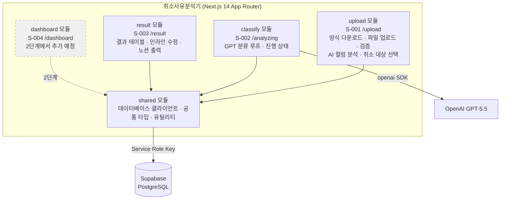
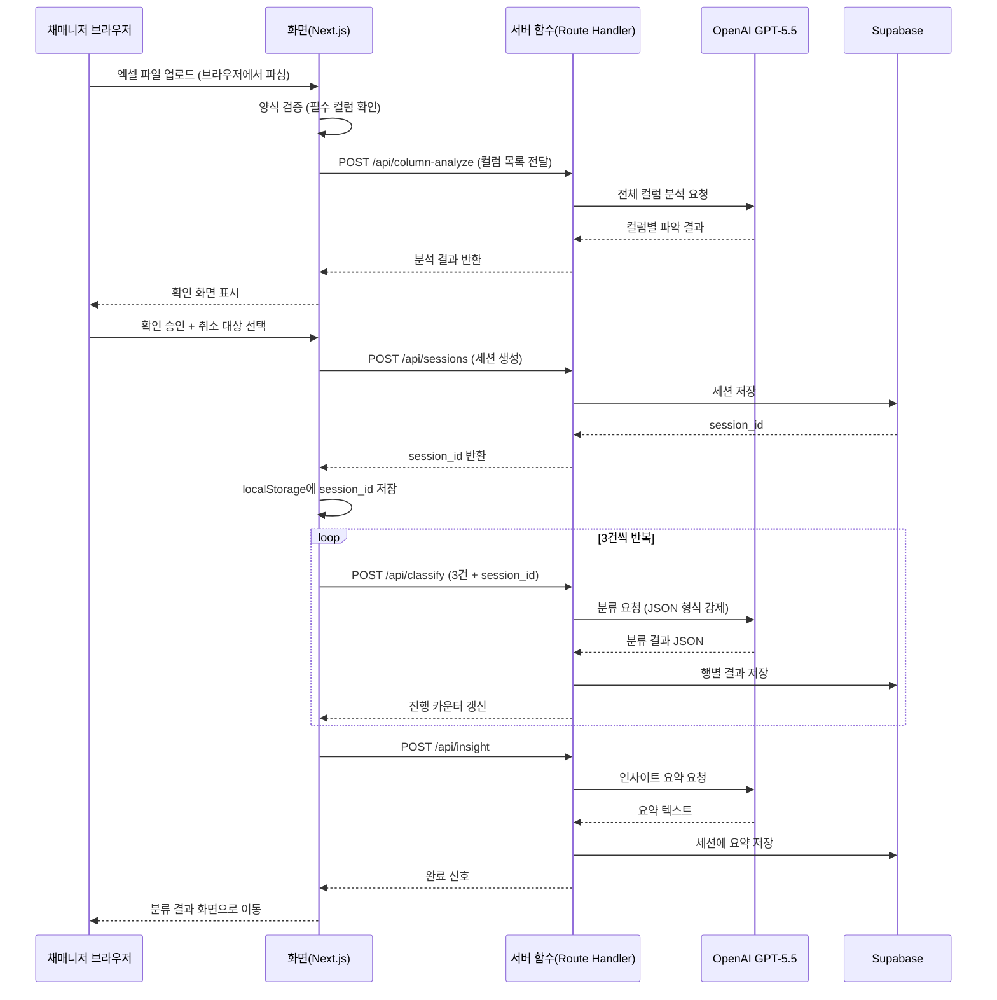
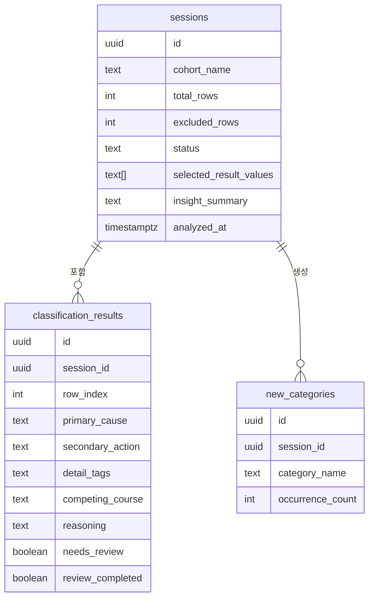

# 취소사유분석기 TRD

> 작성일: 2026-05-21 · 버전: v2.0 (제품 방향 확정 반영)
> PRD: `PRD-취소사유분석기-v2.md`
> FRD: `FRD-취소사유분석기-v2.md`

---

## 1. 한 문단 요약

취소사유분석기는 채매니저 1인이 기수별 취소자 데이터를 고정된 엑셀 양식에 맞춰 업로드하면, GPT-5.5가 전체 컬럼을 자동으로 파악하고 취소 사유를 분류하는 사내 웹 도구다. 1단계는 업로드·분류 실행 중·분류 결과 세 화면으로 구성되며, 대시보드는 2단계에서 추가한다. 기술 구조는 Next.js 14 App Router 하나의 프로젝트 안에 업로드·분류·결과 3개 모듈과 공통(shared) 모듈을 폴더로 나눈 모듈러 모놀로식(단일 서비스 안에 기능별로 명확한 경계를 두는 구조)이다.

기존 TRD 대비 주요 변경 사항은 세 가지다. 첫째, 프리셋 관련 API(저장·조회·삭제)가 제거됐다. 둘째, 컬럼 자동 감지 API가 "전체 컬럼 분석" API로 확장됐다. 셋째, 엑셀 양식 파일을 내려받을 수 있는 정적 파일 제공 경로가 추가됐다. 대시보드 모듈은 2단계까지 제거된 상태다. v1 월 운영 비용은 $0이며, OpenAI API 사용료는 기수당 $0.50 이하(추정)다.

---

## 2. 시스템 구조

취소사유분석기는 Next.js 14 프로젝트 하나가 화면과 서버 기능을 모두 담당하는 풀스택 단일 프로젝트다. 별도 서버를 운영하지 않고 Vercel에서 서버리스 함수(요청이 들어올 때만 실행되는 서버 코드)로 동작한다.

### 2.1 구조 선택: 모듈러 모놀로식

채매니저 1인이 사내에서 단독으로 쓰는 도구에 복잡한 분산 구조를 적용하면 운영 부담이 지나치게 커진다. 반면 코드를 구조 없이 쌓으면 나중에 기능을 추가하거나 수정할 때 어디를 바꿔야 하는지 파악하기 어렵다.

모듈러 모놀로식은 한 프로젝트 안에 두되, 기능별 폴더(모듈)로 명확히 나눠 경계를 유지하는 구조다. 나중에 사용자가 늘거나 특정 기능이 독립해야 할 때 해당 모듈만 꺼낼 수 있다.

| 항목 | 모듈러 모놀로식 (선택) | 분산 서버(MSA) | 단일 파일 |
|---|---|---|---|
| 초기 개발 속도 | 빠름 | 느림 | 빠름 |
| 운영 서버 수 | 1개 | 5~10개 | 1개 |
| 1인 운영 가능 | ✅ | ❌ | ✅ |
| 기능 경계 | 폴더로 분리 | 네트워크로 분리 | 없음 |
| 월 비용 (v1) | $0 | $50~200 | $0 |

### 2.2 모듈 분해 (1단계 기준)

1단계는 3개 화면 + 1개 공통 모듈로 구성된다. 대시보드 모듈은 2단계에서 추가한다.



### 2.3 모듈 간 통신

모듈끼리 직접 코드를 호출하지 않는다. 데이터는 Supabase를 통해 간접 공유되고, 화면 간 상태는 localStorage의 session_id로 전달된다.

---

## 3. 기술 스택

각 영역의 선택과 이유를 설명한다.

### 3.1 화면(프론트엔드)

Next.js 14 App Router 위에 TypeScript, Tailwind CSS, shadcn/ui, Zod를 사용한다.

엑셀 파일 읽기(SheetJS)는 서버가 아닌 사용자 브라우저에서 처리한다. 파일을 서버에 전송하지 않고 브라우저 메모리에서 직접 읽어 JS 배열로 변환하므로 전송 비용이 없다.

노션 출력용 마크다운 텍스트 생성도 브라우저에서 처리한다. 분류 결과를 텍스트로 변환해 클립보드에 복사하는 것이므로 서버 호출이 필요 없다.

| 영역 | 선택 | 이유 |
|---|---|---|
| 프레임워크 | Next.js 14 App Router | 화면과 서버 기능 통합, Vercel 자동 배포 |
| 언어 | TypeScript (엄격 모드) | GPT 응답 파싱 오류를 코드 작성 시점에 잡음 |
| 화면 스타일 | Tailwind CSS | 조건부 색상 처리 용이 (노란·초록 행 표시) |
| UI 부품 | shadcn/ui | 드롭다운·체크박스·모달 제공, 코드 소유권 유지 |
| 검증 | Zod | 취소 대상 체크박스 선택 조건 검증 |
| 엑셀 파싱 | SheetJS (브라우저에서 실행) | 파일을 서버에 업로드하지 않음 |
| 노션 출력 | 브라우저 전용 함수 | 서버 호출 없이 클립보드 복사 |

### 3.2 서버 기능(백엔드)

Next.js Route Handler(서버 전용 API 파일)가 GPT-5.5 호출과 DB 저장을 담당한다. 브라우저는 이 파일을 볼 수 없으며, API 키가 절대 노출되지 않는다.

GPT-5.5 호출 실패 시: 1.5초 대기 후 1회 재시도 → 그래도 실패하면 해당 3건 검토 필요 처리 후 계속 진행.

| 영역 | 선택 | 이유 |
|---|---|---|
| 런타임 | Node.js (TypeScript) | 화면과 동일 언어, 타입 공유 |
| API 구조 | REST (아래 Route Handler 목록 참조) | 표준 방식, AI 개발 도구 호환 |
| GPT 연결 | openai npm 패키지 | 타입 내장, 출력 형식 설정 1줄 |
| DB 클라이언트 | @supabase/ssr (서버 전용 파일에서만) | DB 접근 키가 브라우저에 노출되지 않음 |
| 인증 | 없음 (v1) | 채매니저 단독 사용 |

### 3.3 데이터베이스

Supabase(PostgreSQL)를 사용한다. 프리셋 기능이 삭제됐으므로 column_mappings 테이블은 제거된다. 기존 PRD의 column_mappings 테이블 대신 엑셀 양식이 프리셋 역할을 대신한다.

| 영역 | 선택 | 이유 |
|---|---|---|
| DB | Supabase (PostgreSQL) | 무료 플랜으로 수년간 충분 |
| ORM | 없음 (Supabase 클라이언트 직접) | 3개 테이블에 ORM 불필요 |
| 캐시 | 없음 (v1) | 1인·200행 규모에서 불필요 |

**1단계 테이블 (3개)**
- sessions: 분류 실행 단위 (기수명, 총 행 수, 상태, 선택된 취소 대상 값, 인사이트 요약)
- classification_results: 행별 분류 결과 (1차 원인, 2차 행동, 세부 태그 등)
- new_categories: AI가 자동 생성한 신규 카테고리

**제거된 테이블**
- column_mappings (프리셋 테이블): 고정 양식으로 대체되어 불필요

### 3.4 인프라

| 영역 | 선택 | 비용 |
|---|---|---|
| 배포·호스팅 | Vercel 무료 플랜 | $0 |
| 도메인 | vercel.app 기본 URL | $0 (v1) |
| 자동 배포 | GitHub main 브랜치 push → Vercel 자동 배포 | $0 |
| 자동 실행 작업 | Vercel Cron Job (매일 1회 DB ping, 자동 정지 방지) | $0 |
| 에러 확인 | Vercel 내장 로그 | $0 |

**Supabase 자동 정지 방지**: 무료 플랜은 7일 이상 사용이 없으면 자동으로 DB가 멈춘다. 기수 간 공백이 생길 수 있으므로 Vercel의 자동 실행 기능(Cron Job)을 사용해 매일 한 번 DB에 신호를 보내 이를 방지한다.

---

## 4. 데이터 흐름

채매니저가 파일을 업로드하고 분류 결과를 받기까지의 흐름이다.



### 4.1 데이터 구조 (개요)



---

## 5. 보안

### 5.1 API 키 보호

GPT-5.5 API 키와 DB 접속 정보는 서버에만 저장하며 절대 브라우저에 노출되지 않는다.

```
[허용] 브라우저 → POST /api/classify → 서버 함수 → OpenAI / Supabase
[금지] 브라우저 → Supabase 직접 호출
[허용] 브라우저 → SheetJS로 엑셀 파싱 (파일을 서버에 업로드하지 않음)
[허용] 브라우저 → 노션 마크다운 생성 (순수 텍스트 변환)
```

DB 클라이언트 파일(`shared/supabase/server.ts`)에 `server-only` 패키지를 적용해, 실수로 브라우저 코드에서 호출하면 빌드 시점에 오류가 발생하도록 강제한다.

### 5.2 환경 변수 (서버 전용)

| 변수명 | 용도 | 보안 수준 |
|---|---|---|
| OPENAI_API_KEY | GPT-5.5 호출 키 | 서버 전용, 민감 |
| OPENAI_MODEL | 모델명 (코드 재배포 없이 교체 가능) | 서버 전용 |
| SUPABASE_URL | DB 접속 주소 | 서버 전용 |
| SUPABASE_SERVICE_ROLE_KEY | DB 관리자 키 | 서버 전용, 민감 |

ANON_KEY(공개 접속 키)는 v1에서 사용하지 않는다. 모든 DB 접근을 서버 함수에서만 처리한다.

---

## 6. 서버 함수(API) 목록

| 경로 | 방식 | 역할 | 연결 기능 |
|---|---|---|---|
| /api/ping | GET | DB 자동 정지 방지 (매일 자동 실행) | — |
| /api/column-analyze | POST | GPT-5.5 전체 컬럼 분석 | F-007, F-008 |
| /api/sessions | POST | 신규 분류 세션 생성 | F-013 |
| /api/sessions/[id] | GET | 세션 상태 조회 (재접속 감지) | — |
| /api/sessions/[id] | PATCH | 세션 상태 업데이트 | F-019 |
| /api/classify | POST | GPT-5.5 3건 분류 + DB 저장 | F-014~F-018 |
| /api/insight | POST | GPT-5.5 인사이트 요약 생성 | F-016, F-031 |
| /api/results/[id] | PATCH | 인라인 수정 내용 저장 | F-025, F-026 |

**제거된 서버 함수 (기존 TRD 대비)**
- /api/presets (GET·POST): 프리셋 기능 삭제로 제거
- /api/presets/[id] (DELETE): 프리셋 기능 삭제로 제거
- /api/column-detect → /api/column-analyze로 대체 (단순 감지 → 전체 분석으로 확장)

**추가된 항목**
- 엑셀 양식 파일: 서버 함수 없이 `/public/template/취소사유분석기_양식.xlsx`로 정적 파일 제공

---

## 7. 프로젝트 폴더 구조

```
취소사유분석기/
├── app/
│   ├── upload/
│   │   └── page.tsx              # S-001 — 양식 다운로드, 파일 업로드, AI 분석, 취소 대상 선택
│   ├── analyzing/
│   │   └── page.tsx              # S-002 — 분류 진행 상태
│   ├── result/
│   │   └── page.tsx              # S-003 — 결과 테이블, 인라인 수정, 노션 출력
│   └── api/
│       ├── ping/route.ts         # DB 자동 정지 방지
│       ├── column-analyze/route.ts  # GPT 전체 컬럼 분석
│       ├── sessions/
│       │   ├── route.ts
│       │   └── [id]/route.ts
│       ├── classify/route.ts     # GPT 분류 (타임아웃 9초 설정)
│       ├── insight/route.ts
│       └── results/[id]/route.ts
├── public/
│   └── template/
│       └── 취소사유분석기_양식.xlsx    # 분석용 고정 양식 파일
├── shared/
│   ├── supabase/
│   │   └── server.ts             # server-only, DB 클라이언트 (서버 전용)
│   └── types/
│       └── database.types.ts     # Supabase 타입 자동 생성 파일
└── vercel.json                   # 타임아웃 설정, Cron Job 설정
```

---

## 8. 비용과 운영

### 8.1 월 운영 비용

| 단계 | 상황 | 월 비용 |
|---|---|---|
| v1 현재 | 채매니저 1인, 기수당 분류 | $0 (인프라) + GPT 기수당 $0.50 이하 |
| v1.x | 팀원 포함 | $0 (인프라 동일) |
| v2 | 대시보드·로그인 추가 시 | Supabase Pro 검토 ($25/월) |

### 8.2 운영 부담

Vercel과 Supabase가 서버 운영을 대신한다. 채매니저가 할 일은 "파일 업로드 → 분류 실행 → 결과 확인"뿐이다. DB 자동 정지는 Cron Job이 차단하므로 별도 모니터링이 필요 없다.

### 8.3 서비스 중단 위험 대응

| 위험 | 대응 |
|---|---|
| GPT-5.5 모델 지원 종료 | OPENAI_MODEL 환경 변수만 바꾸면 코드 재배포 없이 교체 가능 |
| Supabase 자동 정지 | Cron Job 매일 1회 ping으로 방지 |
| GPT 응답 오류 | 1.5초 후 1회 재시도 → 실패 시 해당 건 검토 필요 처리 후 계속 |

---

## 9. 성능 기준

| 항목 | 목표 | 초과 시 처리 |
|---|---|---|
| 50건 분류 완료 시간 | 5분 이내 | 개선 필요 시 배치 크기 조정 |
| GPT 호출당 타임아웃 | 9초 | 초과 시 해당 3건 검토 필요 처리 |
| 기수당 API 비용 | $0.50 이하 | 초과 시 배치 크기 재검토 |
| 파일 크기 | 10MB 이하 | 초과 시 안내 메시지 |
| 최대 처리 행 수 | 200행 | 초과 시 양식 분할 안내 |

---

## 10. 2단계 준비 사항

대시보드 모듈(S-004)은 2단계에서 추가된다. 현재 DB 스키마의 sessions 테이블에 유입경로(source)·진행단계(progress_stage) 컬럼이 포함되어 있어, 2단계에서 대시보드를 추가할 때 DB 구조 변경 없이 바로 사용할 수 있다.

또한 토큰 공유 링크(3단계)를 위한 dashboard_tokens 테이블 SQL은 주석 처리된 상태로 보존한다.

---

## 수정 이유 요약

1. 프리셋 관련 서버 함수(API) 3개 삭제 (프리셋 기능 제거 반영)
2. 컬럼 자동 감지 API를 전체 컬럼 분석 API로 교체 (단순 감지 → 전체 분석으로 확장)
3. 엑셀 양식 파일을 정적 파일로 제공하는 경로 추가 (public/template/ 폴더)
4. 대시보드 모듈을 1단계 제거 → 2단계 예정으로 변경 (PRD 변경 반영)
5. column_mappings DB 테이블 삭제 (고정 양식으로 대체되어 불필요)
