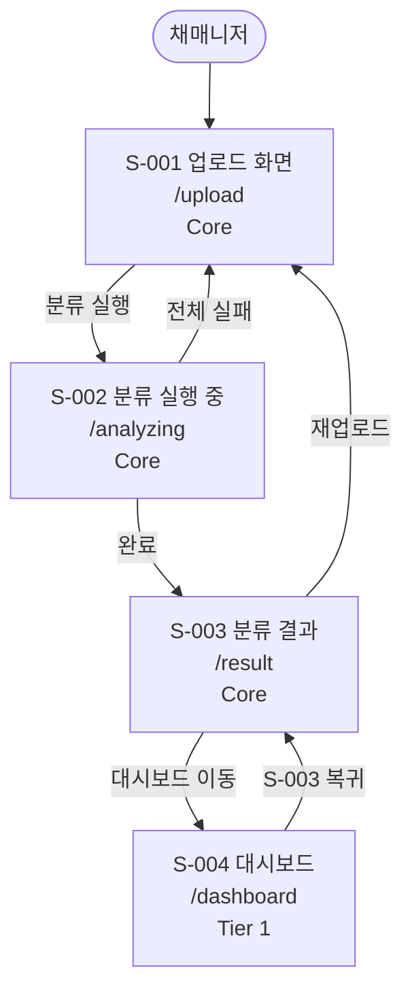
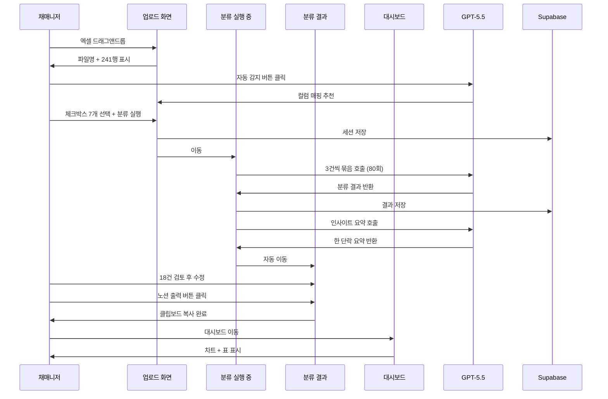
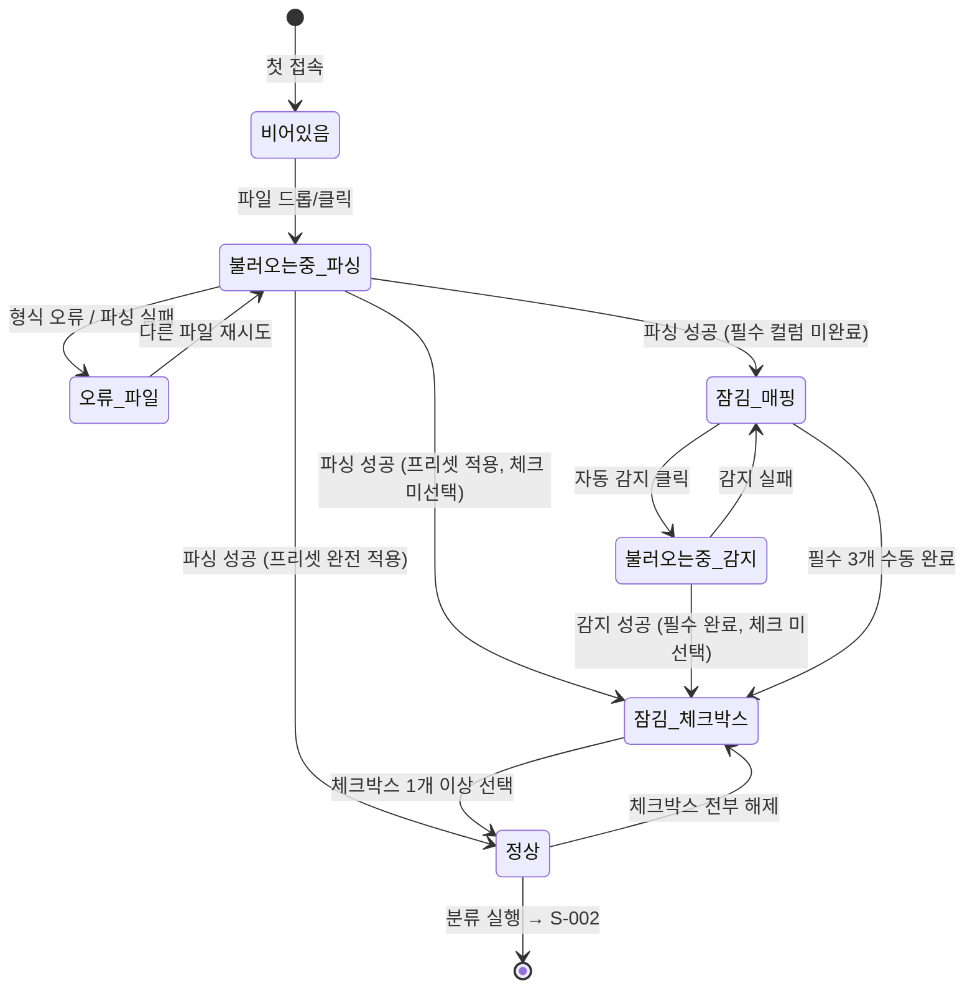
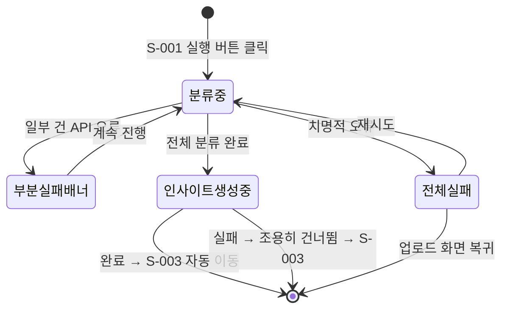
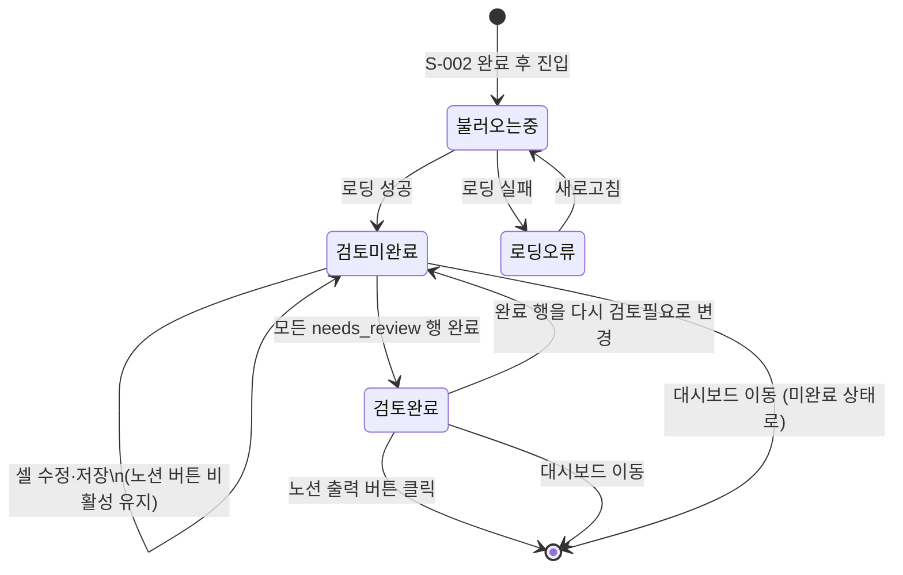
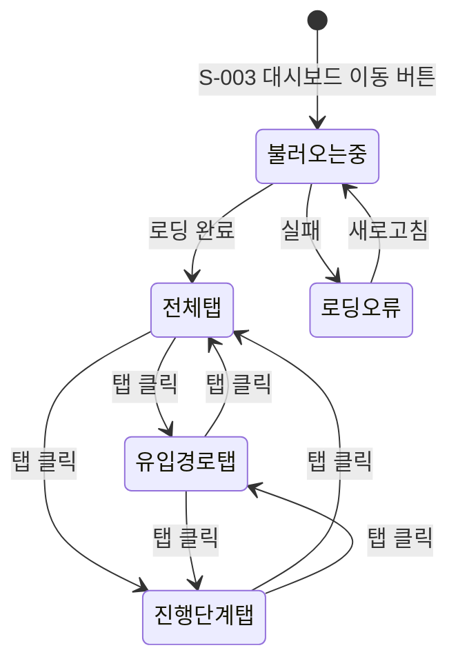
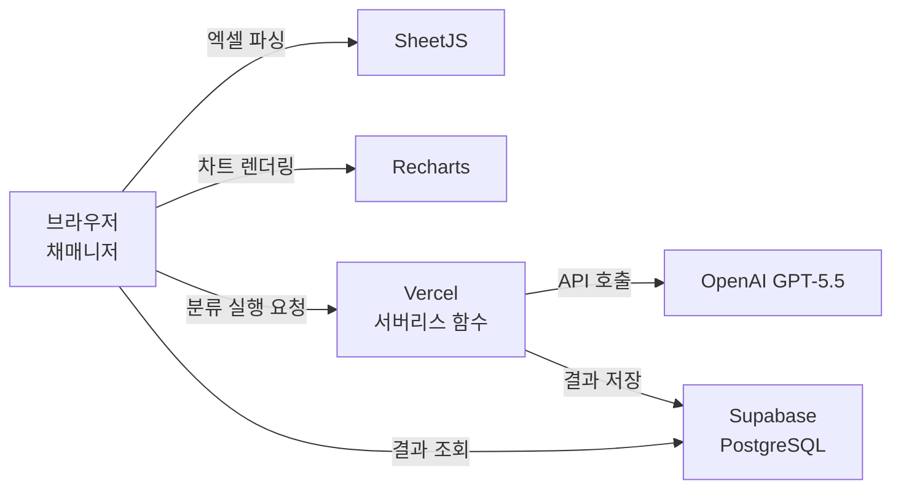

# 취소사유분석기 FRD

> 작성일: 2026-05-19 · 버전: v1.0
> PRD: `prd-취소사유분석기-20260519.md` v1.0
> 다음 단계: TRD (`frd-취소사유분석기-20260519-handoff.md` 참조)

---

## 1. 한 문단 요약

이 FRD는 취소사유분석기의 화면 4개(S-001 업로드, S-002 분류 실행 중, S-003 분류 결과, S-004 대시보드)를 대상으로, 각 화면이 어떻게 보이고 어떻게 동작하는지를 정의한다. 핵심은 S-001~S-003을 잇는 AI 분류 파이프라인 단일 흐름이다. 채매니저가 엑셀을 올리고, GPT-5.5가 취소 사유를 분류하고, 결과를 수정·출력하는 이 흐름이 없으면 대시보드도 노션 출력도 의미가 없다. 4개 화면 모두 v1 출시 범위에 포함된다.

실제 원본 데이터(431행·38개 컬럼)를 분석한 결과, PRD의 "빈 행 제외 = 합격자 제외" 로직이 실제 데이터 구조와 맞지 않아 FRD에서 수정했다. 최종결과 컬럼이 필수 매핑 항목으로 격상되었고, 채매니저가 분석할 취소 유형을 체크박스로 직접 선택하는 단계가 추가되었다. 추정 개발 기간은 1인 기준 2~4주이며, TRD에서는 Next.js App Router의 서버 액션 구조, Supabase RLS 정책, Vercel 서버리스 함수 10초 제한 대응 방식이 주요 결정 사항이 된다.

---

## 2. 무엇을 만드는가 (화면 지도)

채매니저는 항상 업로드 화면에서 시작한다. 파일을 올리고 컬럼을 매핑하고 분석할 취소 유형을 선택한 뒤 분류를 실행하면, 진행 화면을 거쳐 결과 화면으로 이동한다. 결과를 검토하고 수정을 완료하면 노션으로 출력하거나 대시보드로 이동해 시각화된 통계를 확인한다. 네 화면은 단방향 파이프라인으로 연결되며, 각 화면은 직접 URL 접근이 불가능하고 반드시 앞 단계를 거쳐야 진입된다.

### 2.1 전체 화면 흐름



### 2.2 화면 분류 (Tier)

취소사유분석기는 화면 수가 4개로 적다. 그중 S-001~S-003은 빠지면 서비스가 성립하지 않는 핵심(Core) 파이프라인이고, S-004 대시보드는 핵심 결과를 시각화해서 완성도를 높이는 Tier 1 필수 보조 화면이다. v1에서는 4개 전부를 출시한다.

| Tier | 의미 | 화면 | v1 포함 |
|---|---|---|---|
| Core | 빠지면 서비스 불성립 | S-001, S-002, S-003 | ✅ |
| Tier 1 | 핵심 결과를 완성시키는 필수 보조 | S-004 | ✅ |
| v1.x | 출시 후 추가 | 검토필요 필터 버튼(F-025), 200행 초과 안내, 분류 취소 버튼 | ⚠️ |
| v2 | 별도 PRD | 토큰 링크 공유, 모바일 최적화, 기수 간 비교 | ❌ |

> 정밀한 화면 ID 카탈로그(S-001~S-004)와 URL은 핸드오프 §1 참조.

---

## 3. MVP 범위 (핵심 1개)

FRD 전체를 관통하는 가장 중요한 결정은 "이 서비스의 핵심이 무엇인가"이다. 답은 단 하나다. 엑셀을 올리면 GPT-5.5가 취소 사유를 맥락으로 읽어 분류해주는 파이프라인 흐름 자체가 핵심이다. 대시보드도, 노션 출력도, 인사이트 요약도 이 흐름이 없으면 아무런 의미가 없다.

### 3.1 핵심 화면 (Core-1: AI 분류 파이프라인)

채매니저가 엑셀을 업로드하고 컬럼을 매핑한 뒤 분류를 실행하면, GPT-5.5가 취소 건을 3건씩 읽고 1차 원인·2차 행동·세부 태그·타 과정명·판단 근거를 추출한다. 인터뷰 내용이 없는 행(실제 데이터 기준 68%)은 특이사항만으로 판단한다. 분류가 완료되면 결과 테이블이 표시되고, 채매니저는 판단이 불확실한 행만 수정한다.

이 핵심 흐름의 1초 데모 시나리오는 이렇다. "엑셀을 드래그해서 올린다 → 분류 실행 버튼을 누른다 → 결과 테이블에 1차 원인이 채워진다." 이 세 장면이 보이는 순간 서비스의 가치가 전달된다.

### 3.2 v1 출시 범위 합산

핵심 파이프라인(S-001~S-003)에 대시보드(S-004)와 노션 출력·인사이트 요약이 더해져 v1이 완성된다. 채매니저는 분류 → 검토 → 노션 공유 → 대시보드 확인까지 한 번의 업무 사이클을 도구 안에서 완결할 수 있다.

| 항목 | 값 |
|---|---|
| Core 화면 | 3개 (S-001, S-002, S-003) |
| Tier 1 화면 | 1개 (S-004) |
| v1 출시 총 화면 | 4개 |
| v1 총 기능 | 필수 28개 + 선택 2개(F-006, F-034) = 30개 |
| 추정 개발 기간 (1인) | 2~4주 |

---

## 4. 사용자가 화면을 어떻게 거치는가 (시나리오)

채매니저가 이 도구를 사용하는 대표적인 세 가지 흐름을 순서대로 본다. 첫 번째는 도구를 처음 쓰는 날의 흐름이고, 두 번째는 API 오류가 생겼을 때의 흐름이며, 세 번째는 두 번째 기수 분석처럼 반복 사용할 때의 흐름이다.

### 4.1 시나리오 1 — 기수 종료 후 첫 분석 (Happy Path)

기수가 끝나고 취소자 엑셀을 받은 날이다. 채매니저는 파일을 업로드하고 컬럼을 처음 매핑한다. 자동 감지 버튼을 눌러 GPT가 컬럼을 추천해주면 드롭다운을 확인한 뒤 프리셋으로 저장한다. 최종결과 체크박스에서 취소 관련 값 7개를 선택하고 분류를 실행한다. 5분 뒤 결과 테이블이 표시되고, 검토 필요 18건만 읽으며 수정한다. 모두 완료되면 노션 버튼이 활성화되고, 복사 후 팀 문서에 붙여넣는다.



### 4.2 시나리오 2 — 분류 중 브라우저 강제 종료 후 재접속

분류가 진행되는 동안 노트북 배터리가 갑자기 꺼졌다. 충전 후 다시 `/upload`에 접속하면 "이전 분류가 중단되었습니다" 팝업이 표시된다. "새로 시작" 버튼을 누르면 이전 세션은 `status='failed'`로 마킹되고 업로드 화면이 초기화된다. 채매니저는 같은 파일을 다시 올리고 저장된 프리셋이 자동 적용됨을 확인한 뒤 재실행한다.

### 4.3 시나리오 3 — 두 번째 기수 반복 사용

첫 사용 때 저장한 프리셋 덕분에 두 번째 기수 분석은 훨씬 빠르다. 파일을 올리는 순간 드롭다운이 자동으로 채워진다. 이번 기수에서 컬럼 이름이 "인터뷰내용"에서 "면담메모"로 바뀌었다면, 해당 드롭다운에 빨간 테두리가 표시되고 채매니저가 수동으로 수정한다. 체크박스도 이전 선택 상태가 불러와지므로 확인 후 바로 실행한다.

---

## 5. 화면별 명세

각 화면의 명세는 "이 화면은 무엇인가 → 어떻게 보이는가 → 어떻게 동작하는가" 순서로 서술한다. 요소 ID(E-001~)·정규식·인수 기준(AC)은 핸드오프 §3~§5 참조.

### 5.1 S-001 업로드 화면

#### 이 화면은 무엇인가

S-001은 채매니저가 도구를 시작하는 관문이다. 이 화면에서 4단계가 완료되어야 분류를 실행할 수 있다. 첫째, 엑셀 파일을 올린다. 둘째, 인터뷰 내용·특이사항·최종결과 컬럼을 도구에 알려준다(필수 3개). 셋째, 분석할 취소 유형을 체크박스로 선택한다. 넷째, 선택적으로 기수명을 입력한다.

실제 데이터 분석 결과 최종결과 컬럼은 필수로 격상되었다. 이 컬럼 없이는 431행 중 취소자 275건을 합격자·진행중 행과 구분할 방법이 없기 때문이다. 체크박스는 최종결과 컬럼의 고유 값 목록(예: "신청취소(본인요청) 78건", "합격취소(신청자 요청) 50건")을 보여주고, 채매니저가 분석할 값만 선택한다. 선택한 건수 합계가 실시간으로 표시되어 얼마를 분류할지 미리 파악할 수 있다.

프리셋은 이 화면의 핵심 편의 기능이다. 첫 사용 시 컬럼 매핑과 체크박스 선택 상태를 저장하면, 다음 기수부터는 파일을 올리는 즉시 자동으로 적용된다. 자동 적용된 컬럼명이 실제 파일 헤더에 없으면 해당 드롭다운에 빨간 테두리로 경고를 표시해 오매핑을 방지한다.

#### 어떻게 보이는가

화면 상단 중앙에 드래그앤드롭 업로드 영역이 있고, "xlsx, xls 파일만 지원" 안내가 항상 표시된다. 파싱이 완료되면 파일명·유효 행 수·빈 행 제외 건수가 업로드 영역 아래에 나타난다. 기수명 입력 필드는 상단 우측에 위치하며 선택 입력이다.

| 사용자가 보는 것 | 비고 |
|---|---|
| 파일 업로드 영역 (드래그앤드롭) | xlsx/xls 안내 문구 항상 표시. 10MB 제한 |
| 파일명 + 유효 행 수 표시 | 파싱 완료 후 표시 |
| 기수명 입력 필드 | 선택 입력. 최대 100자 |
| 컬럼 매핑 섹션 (필수 3개 + 선택 1개 드롭다운) | 인터뷰 내용·특이사항·최종결과 필수(✱). 유입경로 선택 |
| 자동 감지 시도 버튼 | 파일 파싱 완료 후 활성화 |
| 최종결과 값 체크박스 목록 | 최종결과 드롭다운 선택 완료 후 표시. 건수 병기 |
| 프리셋 불러오기 / 저장 버튼 | 체크박스 선택 상태도 함께 저장 |
| 분류 실행 버튼 | 필수 3개 + 체크박스 1개 이상 시 활성화 |

> 정밀한 요소 ID(E-001~E-015)는 핸드오프 §3.1 참조.

#### 어떻게 동작하는가 (5개 상태)

S-001은 상황에 따라 다섯 가지 모습을 갖는다.

**정상 (Success)**: 필수 컬럼 3개가 모두 매핑되고 체크박스가 1개 이상 선택된 상태다. 분류 실행 버튼이 파란색으로 활성화되고, 선택된 분석 대상 건수 합계가 버튼 위에 표시된다(예: "선택된 분석 대상: 241건 / 전체 431행"). 이 상태에서 버튼을 클릭하면 S-002로 이동한다.

**비어있을 때 (Empty)**: 처음 `/upload`에 접속했을 때의 상태다. 업로드 영역만 강조되고 컬럼 매핑 섹션·체크박스 섹션은 표시되지 않는다. 저장된 프리셋이 있으면 "마지막 저장: [프리셋명]" 안내 문구가 업로드 영역 아래에 표시된다.

**불러오는 중 (Loading)**: 두 상황에서 발생한다. 파일 파싱 중일 때는 업로드 영역에 스피너와 "파일을 읽는 중..." 문구가 표시된다. 자동 감지 버튼 클릭 후 GPT-5.5 호출 중일 때는 버튼 위치에 스피너와 "컬럼 감지 중..." 문구가 표시된다.

**문제가 생겼을 때 (Error)**: 세 가지 경우를 각각 다르게 처리한다. xlsx/xls 외 파일은 업로드 영역 하단에 빨간 텍스트("xlsx 또는 xls 파일만 지원합니다"). 파싱 실패는 "파일을 읽지 못했습니다" 팝업. 자동 감지 실패는 컬럼 매핑 섹션 상단에 노란 안내("자동 감지에 실패했습니다. 직접 지정해 주세요")와 함께 드롭다운 편집 상태 유지.

**잠겼을 때 (Disabled)**: 파일은 파싱됐지만 분류 실행 조건 미충족 상태다. 필수 컬럼 미완료 시 버튼 하단에 구체적 안내("인터뷰 내용 컬럼을 지정해 주세요"). 체크박스 미선택 시 "분석할 취소 유형을 1개 이상 선택해 주세요". 재접속 시 이전 analyzing 세션 감지 팝업도 이 상태에서 표시된다.



#### 인터랙션 핵심

채매니저가 이 화면에서 하는 행동은 크게 파일 올리기, 컬럼 지정하기, 취소 유형 선택하기의 세 가지다.

| 사용자 행동 | 시스템 반응 |
|---|---|
| 파일 드래그앤드롭 | 파싱 시작. 완료 시 파일명·행 수 표시. 프리셋 있으면 자동 적용. 불일치 컬럼 빨간 테두리 |
| 최종결과 드롭다운 선택 | 해당 컬럼의 고유 값 목록을 체크박스로 즉시 표시 |
| 체크박스 선택 | 선택 건수 합계 실시간 갱신. 조건 충족 시 버튼 활성화 |
| 자동 감지 버튼 클릭 | GPT-5.5 컬럼 헤더 분석 → 드롭다운 자동 채움 (파싱 완료 후에만 활성) |
| 프리셋 저장 버튼 클릭 | 현재 드롭다운 + 체크박스 상태 저장. 동일 이름 존재 시 덮어쓰기 확인 팝업 |
| 분류 실행 버튼 클릭 | Supabase sessions 테이블에 저장. localStorage에 session_id 기록. S-002 이동 |

---

### 5.2 S-002 분류 실행 중 화면

#### 이 화면은 무엇인가

S-002는 채매니저가 기다리는 화면이다. GPT-5.5가 체크박스로 선택된 취소 건을 3건씩 묶어 순차적으로 분류하는 동안 진행 상황을 보여준다. 이 화면의 핵심 역할은 두 가지다. 하나는 "지금 잘 돌아가고 있다"는 확신을 줘서 채매니저가 이탈하지 않게 하는 것이고, 다른 하나는 오류가 생겼을 때 어떻게 처리됐는지 투명하게 알리는 것이다.

분류가 완료되면 자동으로 2단계로 전환된다. GPT-5.5가 전체 분류 결과를 읽고 인사이트 요약 한 단락을 생성하는 단계다. 이 단계가 실패해도 안내 없이 건너뛰고 S-003으로 이동한다.

#### 어떻게 보이는가

| 사용자가 보는 것 | 단계 | 비고 |
|---|---|---|
| 진행 카운터 "N건 분류 중 · M / N 완료" | 1단계 | 3건 완료마다 갱신 |
| 진행 바 | 1단계 | M/N 비율로 실시간 갱신 |
| "분류 완료! 인사이트 요약 생성 중..." + 스피너 | 2단계 | 인사이트 생성 시 표시 |
| 부분 실패 배너 (노란색) | 오류 시 | "N건 분류 실패 — 검토 필요로 자동 처리됩니다" |
| 전체 실패 메시지 + 재시도 버튼 | 전체 실패 | "재시도" + "업로드 화면으로 돌아가기" |

#### 어떻게 동작하는가 (5개 상태)

**정상 (Success)**: 완료 즉시 S-003으로 자동 이동한다. 별도 완료 화면을 보여주지 않는다.

**비어있을 때 (Empty)**: 직접 URL 접근 불가. `/upload`로 리다이렉트.

**불러오는 중 (Loading)**: 두 단계가 순차적으로 표시된다. 1단계는 분류 진행(카운터·진행 바), 2단계는 인사이트 생성(스피너).

**문제가 생겼을 때 (Error)**: 부분 실패 시 해당 행만 `needs_review=true`로 태깅하고 분류를 계속한다. 노란 배너로 실패 건수를 안내한다. 전체 실패(API 키 오류·네트워크 완전 단절) 시 진행이 멈추고 재시도 버튼이 표시된다. 인터뷰·특이사항 둘 다 빈 행은 GPT에 보내지 않고 `reasoning="인터뷰 내용 및 특이사항 없음"`, `needs_review=true`로 자동 처리한다.

**잠겼을 때 (Disabled)**: 분류 진행 중 이탈 시도 시 브라우저 기본 경고가 표시된다. 이탈하면 진행 중 분류가 손실된다.



#### 인터랙션 핵심

이 화면에서 채매니저가 할 수 있는 액션은 최소화된다. 기다리거나, 전체 실패 시 재시도하거나, 업로드 화면으로 돌아가는 것이 전부다.

| 사용자 행동 | 시스템 반응 |
|---|---|
| 아무것도 안 함 (대기) | 카운터 자동 갱신 → 완료 시 S-003 이동 |
| 탭 닫기 / 뒤로가기 시도 | 브라우저 기본 경고 팝업 |
| 재시도 버튼 클릭 (전체 실패 시) | 처음부터 재분류 시작 |
| "업로드 화면으로 돌아가기" 클릭 | S-001 이동. 현재 세션 failed 처리 |

---

### 5.3 S-003 분류 결과 화면

#### 이 화면은 무엇인가

S-003은 채매니저가 실제로 일을 하는 화면이다. GPT-5.5가 분류한 전체 결과를 테이블로 보여주고, 판단이 불확실하다고 표시된 행(노란 하이라이트)만 직접 수정한다. 모든 검토가 완료되면 노션 출력 버튼이 활성화된다.

이 화면의 핵심 설계 원칙은 "최소 액션으로 최대 정확도"다. 검토가 필요한 행만 노란 배경으로 눈에 띄게 표시하고, 행을 클릭하면 오른쪽 사이드 패널에 원문(인터뷰 내용·특이사항)이 펼쳐져 수정과 원문을 동시에 볼 수 있다. 셀 밖을 클릭하는 것만으로 자동 저장되고, 완료 처리 시 즉시 초록색으로 전환된다.

화면 하단에는 신규 카테고리 섹션이 있다. GPT-5.5가 기본 6개 항목으로 설명하지 못해 새로 만든 카테고리명 목록이 최대 10개까지 표시된다. 반복 등장하는 신규 카테고리가 있다면 채매니저가 표준 항목으로 승격할지 판단할 수 있다.

#### 어떻게 보이는가

화면 최상단에 요약 바가 고정된다. "전체 241건 | 검토 필요 18건 · 완료 N건 | 신규 카테고리 3개" 형태로 실시간 갱신된다. 그 아래에 전체 분류 결과 테이블이 있고, 화면 오른쪽 40% 영역이 사이드 패널로 사용된다.

| 사용자가 보는 것 | 편집 여부 | 비고 |
|---|---|---|
| 상단 요약 바 | 읽기 전용 | 검토 진행 상황 실시간 반영 |
| 분류 결과 테이블 (화면 60%) | 일부 편집 가능 | 검토필요 행: 노란 배경. 완료 행: 초록 배경 |
| 원문 사이드 패널 (화면 40%) | 읽기 전용 | 행 클릭 시 인터뷰 내용 + 특이사항 원문 표시 |
| 테이블 컬럼: 최종결과·유입경로 | 읽기 전용 | 원본 엑셀 값 |
| 테이블 컬럼: 1차원인·2차행동·세부태그·검토필요여부 | **편집 가능** | 셀 밖 클릭 시 자동 저장 |
| 테이블 컬럼: 타과정명·판단근거 | 읽기 전용 | GPT 추출값 |
| 노션 출력 버튼 | 조건부 활성 | 검토 미완료 시 회색. 완료 시 파란색 |
| 신규 카테고리 섹션 (하단) | 읽기 전용 | 0건이면 섹션 미표시. 최대 10개 + "N개 더 보기" |
| 대시보드 이동 버튼 | 항상 활성 | 검토 미완료 시에도 이동 가능 |

> 정밀한 요소 ID(E-030~E-040)는 핸드오프 §3.3 참조.

#### 어떻게 동작하는가 (5개 상태)

**정상 (Success — 검토 미완료)**: 분류 결과 테이블이 표시된다. 검토 필요 행은 노란 배경, 완료 행은 초록 배경이다. 노션 버튼은 회색 비활성 상태이며 "검토 필요 N건을 먼저 완료해 주세요" 안내가 함께 표시된다.

**정상 (Success — 검토 완료)**: 모든 `needs_review` 행의 `review_completed`가 true가 되면 노션 출력 버튼이 파란색으로 활성화된다.

**비어있을 때 (Empty)**: 직접 URL 접근 불가. `/upload`로 리다이렉트.

**불러오는 중 (Loading)**: S-002에서 이동하는 순간 Supabase에서 분류 결과를 불러오는 동안 테이블 스켈레톤 UI가 표시된다.

**문제가 생겼을 때 (Error)**: 데이터 로딩 실패 시 "결과를 불러오지 못했습니다. 새로고침해 주세요" + 새로고침 버튼. 셀 저장 실패 시 해당 셀에 빨간 테두리 + "저장 실패 — 다시 시도해 주세요". 노션 복사 실패 시 텍스트박스 폴백("복사에 실패했습니다. 아래 텍스트를 직접 복사해 주세요").



#### 인터랙션 핵심

검토·수정·출력의 세 흐름이 이 화면의 핵심이다.

| 사용자 행동 | 시스템 반응 |
|---|---|
| 행 클릭 | 사이드 패널에 해당 행 원문 표시 (300ms 이내) |
| 편집 가능 셀 클릭 후 수정 | 셀이 편집 모드로 전환 |
| 셀 밖 클릭 (blur) | 자동 저장 + "저장됨 ✓" 토스트 1초 표시 |
| 1차원인을 빈값으로 저장 | 저장은 허용. `review_completed` 자동 차단 |
| 검토필요여부 토글 → "아니오" | 행 배경 초록색 전환. 완료 건수 +1. 요약 바 갱신 |
| 노션 출력 버튼 클릭 (활성 시) | 마크다운 테이블 + TOP3 요약 클립보드 복사. "복사됨!" 토스트 |
| 노션 출력 — 복사 실패 시 | 텍스트박스 폴백 표시 |

**노션 출력 마크다운 컬럼 순서**: `1차원인 | 2차행동 | 세부태그 | 타과정명 | 판단근거 | 검토필요`

**노션 TOP3 요약 생성 방식**: GPT 추가 호출 없음. `primary_cause` 건수 집계 상위 3개를 아래 형식으로 자동 생성.
```
## 취소 사유 TOP3
1. [1위 원인] — N건 (X%)
2. [2위 원인] — N건 (X%)
3. [3위 원인] — N건 (X%)
```

---

### 5.4 S-004 대시보드 화면

#### 이 화면은 무엇인가

S-004는 채매니저가 분류 결과를 전략적 관점으로 해석하는 화면이다. S-003에서 검토까지 완료된 분류 데이터가 차트와 표로 시각화되어 "이번 기수에서 무슨 일이 있었나", "어떤 유입경로의 취소율이 높은가", "인터뷰 전과 후의 취소 이유가 다른가"를 한눈에 파악할 수 있다.

탭 3개는 같은 데이터를 다른 렌즈로 보여준다. 전체 탭은 이번 기수 전체 취소 패턴을 본다. 유입경로별 탭은 SNS 광고·검색·지인 추천 등 경로별로 취소 원인이 다른지 비교한다. 진행 단계별 탭은 인터뷰 전에 떠난 사람과 합격 후 취소한 사람의 이유가 다른지 분석한다. 세 탭 모두 추가 API 호출 없이 이미 불러온 분류 데이터를 집계해 표시한다.

S-003 검토가 완료되지 않은 상태에서 이동하면, 화면 상단에 "아직 N건 검토가 남았습니다" 배너와 S-003으로 돌아가는 링크가 표시된다. 채매니저 판단에 따라 미완료 상태로도 대시보드를 볼 수 있다.

#### 어떻게 보이는가

| 사용자가 보는 것 | 위치 | 비고 |
|---|---|---|
| 검토 미완료 배너 | 최상단 | S-003 검토 미완료 시에만 표시 |
| 기수명 + 분석 일시 | 상단 고정 | 미입력 시 "기수명 미입력" |
| GPT 인사이트 요약 | 상단 | "⚠️ AI 자동 생성 요약입니다. 참고용으로만 활용하세요" 안내 포함. 생성 실패 시 미표시 |
| 탭 네비게이션 | 중단 | 전체 / 유입경로별 / 진행 단계별 |
| 취소 사유 TOP5 (가로 막대 + 표) | 전체 탭 | 1~4건이면 "취소 사유 분포"로 제목 변경 |
| 후속 행동 분포 (도넛 + 표) | 전체 탭 | |
| 타 과정 언급 현황 (표) | 전체 탭 | 언급 없으면 미표시 |
| 검토 필요 목록 (읽기 전용 테이블) | 전체 탭 | 0건이면 "검토 필요 항목 없음 ✅" |
| 유입경로별 취소 건수 (세로 막대 + 표) | 유입경로 탭 | 미매핑 시 안내 문구 + 링크 |
| 유입경로별 TOP3 원인 (묶음 가로 막대 + 표) | 유입경로 탭 | |
| 진행 단계별 취소 건수 (세로 막대 + 표) | 진행단계 탭 | |
| 진행 단계별 TOP3 원인 (묶음 가로 막대 + 표) | 진행단계 탭 | |

> 정밀한 요소 ID(E-050~E-062)는 핸드오프 §3.4 참조.

**진행 단계 자동 파싱 규칙 (코드 하드코딩)**

| 최종결과 값 | 진행 단계 분류 |
|---|---|
| 신청취소(인터뷰 전), 신청취소(연락X), 신청취소(인터뷰노쇼) | 인터뷰 전 |
| 합격취소(신청자 요청), 합격취소(연락두절), 인터뷰불합격, 신청취소(조건부적합) | 인터뷰 후 |
| 신청취소(본인요청) | 인터뷰 내용 있으면 "인터뷰 후", 없으면 "인터뷰 전" |
| 그 외 선택된 값 | 기타 |

#### 어떻게 동작하는가 (5개 상태)

**정상 (Success)**: 차트·표 전체가 표시된다. 탭 전환은 즉시 이루어지며 추가 API 호출이 없다.

**비어있을 때 (Empty)**: 직접 URL 접근 불가. `/upload`로 리다이렉트. 분류 결과가 0건인 경우 "분류된 결과가 없습니다. S-003으로 돌아가 확인해 주세요" + 링크 표시.

**불러오는 중 (Loading)**: 차트 영역별로 스켈레톤 UI가 순차적으로 채워진다.

**문제가 생겼을 때 (Error)**: 섹션별로 독립적으로 처리한다. 특정 차트 로딩 실패 시 해당 섹션에만 "데이터를 불러오지 못했습니다. 새로고침해 주세요" + 버튼. GPT 인사이트 실패 시 해당 영역 조용히 숨김.

**잠겼을 때 (Disabled)**: 유입경로 컬럼이 매핑되지 않은 경우 유입경로 탭 차트 영역 대신 안내 문구 + 업로드 화면 링크 표시.



#### 인터랙션 핵심

| 사용자 행동 | 시스템 반응 |
|---|---|
| 탭 클릭 | 즉시 해당 탭 차트·표 표시 (추가 API 호출 없음) |
| 검토 미완료 배너 링크 클릭 | S-003으로 이동 |
| 유입경로 미매핑 안내 링크 클릭 | S-001(/upload)로 이동 |

---

## 6. 공통 컴포넌트와 권한

모든 화면에 걸쳐 반복되는 공통 요소와 접근 권한을 정의한다.

### 6.1 공통 컴포넌트

취소사유분석기는 사내 단독 사용 도구이므로 공통 헤더·푸터가 최소화된다. 공통으로 사용되는 요소는 토스트 알림(저장됨·복사됨·오류 메시지, 화면 하단 우측에 1~3초 표시)과 브라우저 이탈 경고(S-002에서 beforeunload 이벤트)이다.

| 공통 요소 | 등장 화면 | 동작 |
|---|---|---|
| 저장됨 ✓ 토스트 | S-003 | 셀 저장 성공 시 1초 표시 |
| 복사됨! 토스트 | S-003 | 노션 클립보드 복사 성공 시 1초 표시 |
| 오류 토스트 | 전체 | API 오류 발생 시 3초 표시 |
| 이탈 경고 (브라우저 기본) | S-002 | 분류 진행 중 이탈 시도 시 |
| 덮어쓰기 확인 팝업 | S-001 | 프리셋 동일 이름 저장 시 |

### 6.2 권한 요약

v1은 채매니저 단독 사용이다. 별도 인증이 없으므로 URL을 아는 누구나 접근 가능하다. 단, 세션 없이 `/analyzing`, `/result`, `/dashboard`로 직접 접근하면 `/upload`로 리다이렉트된다. v2에서 토큰 링크 공유(대시보드 읽기 전용 열람)가 추가될 예정이다.

| 화면 | 채매니저 | 직접 URL 접근 시 |
|---|---|---|
| S-001 /upload | ✅ | ✅ 정상 표시 |
| S-002 /analyzing | ✅ | ❌ /upload 리다이렉트 |
| S-003 /result | ✅ | ❌ /upload 리다이렉트 |
| S-004 /dashboard | ✅ | ❌ /upload 리다이렉트 |

> 정밀한 화면·기능별 권한 매트릭스는 핸드오프 §2 참조.

---

## 7. 외부에 무엇이 필요한가 (의존성)

이 서비스는 세 가지 외부 서비스에 의존한다. 가장 중요한 것은 GPT-5.5 API로, 이것이 없으면 핵심 분류 기능 자체가 불가능하다.

| 의존 대상 | 용도 | 누락 시 영향 |
|---|---|---|
| OpenAI GPT-5.5 (gpt-5.5-2026-04-23) | 취소 사유 분류 · 컬럼 자동 감지 · 인사이트 요약 | 핵심 기능 전체 불가 |
| Supabase (PostgreSQL) | 세션·분류 결과·프리셋·신규 카테고리 영구 저장 | 결과 저장 불가. 새로고침 시 데이터 소실 |
| SheetJS (xlsx) | 엑셀 파일 파싱 (브라우저 클라이언트 사이드) | 업로드 기능 불가 |
| Recharts | 대시보드 차트 렌더링 | 대시보드 표만 표시 (차트 없음) |
| Vercel | 호스팅 + 서버리스 함수 (GPT 호출 서버 사이드 처리) | 서비스 전체 불가 |



> API 엔드포인트·인증 방식·요청 형식 정밀 명세는 핸드오프 §7 참조. TRD에서 더 깊게 다룬다.

---

## 8. Blindspot Check 요약

FRD 작성 중 5종 관점으로 자동 점검한 결과다.

| 점검 항목 | 결과 | 비고 |
|---|---|---|
| 5개 상태 정의 (Empty·Loading·Error·Success·Disabled) | ✅ 4개 화면 모두 정의 | S-002 Success = S-003 자동 이동으로 처리 |
| 예외 흐름 | ✅ 주요 예외 정의 완료 | 강제이탈 재접속·부분실패·복사실패 등 |
| 권한 매트릭스 | ✅ v1 채매니저 단독. 직접 URL 차단 | v2 토큰 링크는 별도 PRD |
| 검증 규칙 | ✅ 주요 규칙 정의 완료 | 파일 10MB·기수명 100자·태그 50자·빈값 처리 |
| 엣지 케이스 | ✅ 주요 케이스 대응 완료 | 0건·1건·신규카테고리 대량·다중탭 등 |

상세 발견 사항과 대응은 부록 A 참조.

---

## 9. 미해결 / 향후 단계

FRD v1.0에서 의도적으로 미룬 항목들이다. 대부분 v2 기획 시 별도 PRD가 필요하다.

- **토큰 링크 공유**: 채매니저가 생성한 URL로 팀원이 대시보드를 읽기 전용으로 열람. Supabase `dashboard_tokens` 테이블(주석 처리된 상태)을 활성화하고 별도 PRD 작성 → v2
- **대시보드 모바일 최적화**: 팀원 스마트폰(360px 이상) 열람 대응 → v2
- **기수 간 비교 대시보드**: 여러 기수 누적 데이터 비교 → v2
- **분류 기준 커스터마이징 UI**: 기본 6개 항목 정의를 채매니저가 직접 수정 → v2
- **GPT 모델 변경 대응**: gpt-5.5-2026-04-23 단종 시 프롬프트 재검증 필요 → TRD에서 마이그레이션 가이드 작성

---

## 부록 A. 적대적 검토 결과

```
━━━ 🔍 적대적 검토 ━━━
검토 관점: Dev + QA (TRD 작성자 관점)
검토 대상: 취소사유분석기 FRD v1.0

🔴 HIGH — 노션 출력 TOP3 요약 생성 방식 미정의
  → FRD 확정: primary_cause 건수 집계 상위 3개 자동 생성. GPT 추가 호출 없음.

🔴 HIGH — 재접속 세션 감지를 위한 클라이언트 저장 방식 미정의
  → FRD 확정: 분류 실행 시 localStorage에 session_id 저장.
    재접속 시 status 조회 → 'analyzing'이면 팝업 표시.

🟡 MEDIUM — 분류 중 다중 탭 동시 실행 방어 없음
  → FRD 확정: 실행 시 localStorage에 'classifying=true' 플래그 설정.
    다른 탭 실행 시 "이미 분류가 진행 중입니다" 안내.

🟡 MEDIUM — GPT-5.5 JSON 필드 누락 시 처리 미정의
  → FRD 확정: 누락 필드 기본값 적용 (primary_cause: "",
    detail_tags: [], needs_review: true, 나머지: null).

🟢 LOW — 프리셋 이름 중복 저장 처리 미정의
  → FRD 확정: 동일 이름 저장 시 덮어쓰기 확인 팝업.

🟢 LOW — 대시보드 인사이트 생성 실패 시 재시도 없음
  → v1 허용. 채매니저가 원하면 S-001부터 재업로드.

━━━ 요약 ━━━
🔴 HIGH: 2건 → FRD 내 확정 처리 완료
🟡 MEDIUM: 2건 → FRD 추가 명세 완료
🟢 LOW: 2건 → v1 허용 또는 팝업 추가

진행 판정: 전체 해결. TRD 진행 가능.
━━━━━━━━━━━━━━━━━━━━━━━
```
