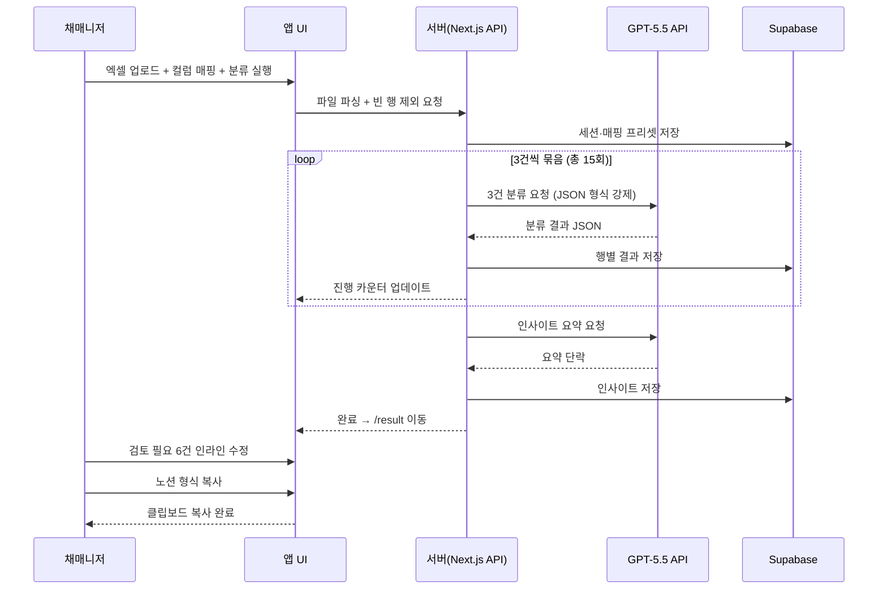
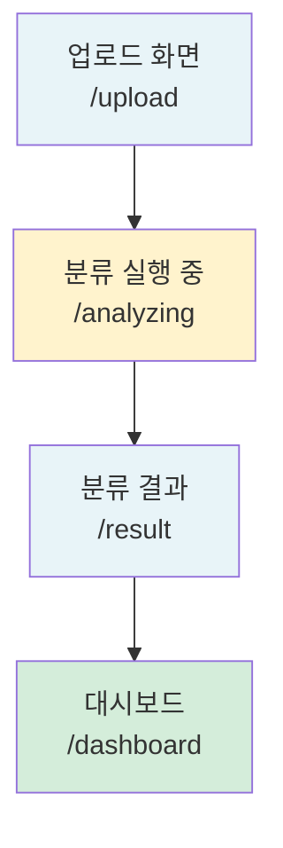
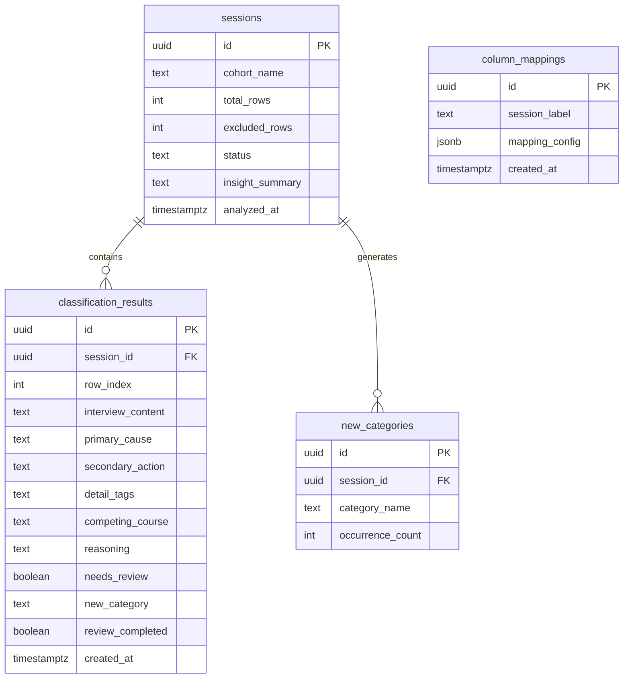
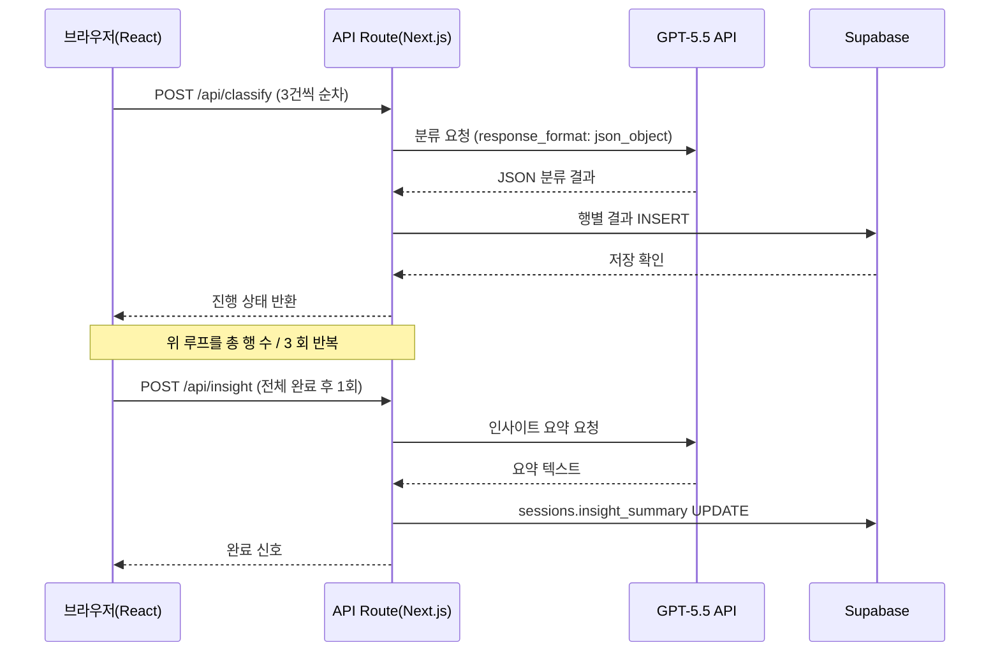

# 취소사유분석기 PRD

> 작성일: 2026-05-19 · 버전: v1.0 · 작성자: 최원재 · 회사: 아이티커넥트㈜
> 다음 단계: FRD (`prd-취소사유분석기-20260519-handoff.md` 참조)

---

## 1. 한 문단 요약

취소사유분석기는 교육과정 모집 담당자가 기수 종료 후 반복 수행하는 취소자 분석 업무를 자동화하는 사내 웹 도구다. 담당자는 취소자 엑셀 파일을 업로드하면 GPT-5.5가 인터뷰 내용과 특이사항을 맥락 전체로 읽고, 1차 원인·2차 행동·세부 태그·타 과정명·판단 근거·검토 필요 여부 6개 항목으로 자동 분류한다. 기존 키워드 필터로는 불가능했던 복합 사유 동시 추출과 신규 카테고리 자동 생성이 핵심 차별점이며, 분류 완료 후 노션 붙여넣기 형식 문서와 3뷰 대시보드(전체·유입경로별·진행 단계별)를 즉시 제공한다.

개발 기간은 1인 기준 2~4주이며, 인프라 비용은 GPT-5.5 API 요금 확인 후 갱신 예정이다. 기술 구현의 핵심 리스크는 GPT-5.5 분류 정확도와 Vercel 서버리스 실행 시간 제약 두 가지로, 각각 3건 묶음 호출 방식과 Supabase 영속 저장으로 대응한다.

---

## 2. 왜 만드는가

### 2.1 현재 어떻게 일하고 있나

기수가 종료되면 담당자는 신청·취소 데이터 엑셀을 전달받아 분석을 시작한다. 먼저 엑셀 필터와 찾기 기능으로 "내일배움카드" "취소" 같은 키워드를 걸러낸 뒤, 불명확한 건은 인터뷰 내용 열을 하나씩 읽으며 직접 분류한다. 기수당 취소자가 40~60명 수준이면 이 과정만으로 2~3시간이 소요된다. 분류 결과는 별도 시트에 수동으로 옮기고, 이를 다시 정리해 팀장에게 구두 또는 메신저로 보고한다.

### 2.2 무엇이 답답한가

키워드 필터의 결정적 한계는 복합 사유를 잘라버린다는 점이다. "내일배움카드 발급이 늦어져 타 과정을 신청하려고 함"이라는 문장에서 키워드 필터는 "내일배움카드" 또는 "타 과정" 중 하나만 잡는다. 실제로 필요한 판단은 1차 원인(내일배움카드 이슈)과 2차 행동(타 과정 신청)을 동시에 추출하는 것인데, 이 판단은 문장 전체를 읽어야만 가능하다. 결국 키워드로 1차 걸러낸 뒤 사람이 다시 읽어야 하는 이중 작업이 반복되고, 담당자마다 분류 기준이 달라 기수 간 데이터 비교도 어렵다.

### 2.3 우리가 어떻게 바꾸는가

취소사유분석기는 엑셀 업로드 한 번으로 이 과정 전체를 대체한다. GPT-5.5가 인터뷰 내용과 특이사항을 문장 수준에서 읽고 6개 항목을 동시에 추출하며, 기존 항목으로 설명되지 않는 사유가 등장하면 신규 카테고리를 자동 생성한다. 인터뷰·특이사항 컬럼이 모두 비어있는 행(합격자 등)은 자동으로 분류 대상에서 제외한다. AI가 확신하지 못한 건만 "검토 필요"로 표시해 담당자가 1회 검토로 마무리하고, 노션 형식 문서를 복사하거나 대시보드 화면을 직접 확인하는 흐름이 만들어진다. 대시보드 공유 링크(토큰 기반 접근 제어)는 v2에서 추가한다.

---

## 3. 누가 쓰는가

이 도구를 주로 사용하는 사람은 교육과정 운영사에서 마케팅과 모집을 담당하는 직원이다. 기수마다 반복되는 취소자 분석 업무를 직접 수행하면서, 분석 결과를 노션 문서로 팀장에게 공유하는 역할을 겸한다.

### 3.1 핵심 페르소나

| 변수 | 값 |
|---|---|
| 이름 | 채매니저 |
| 직업·역할 | 교육과정 운영사 직원, 마케팅/모집 총괄 담당 |
| 디지털 숙련도 | 노션·구글 워크스페이스·엑셀 능숙. 코드 안 씀. AI 도구 직접 사용 경험 있음 |
| 사용 기기 | 노트북 위주 |
| 사용 맥락 | 기수 종료 후 취소자 엑셀을 받아 분석하는 주기적 업무. 회의 전 빠르게 결과를 뽑아야 하는 시간 압박 상황 |
| 핵심 동기 | 기수마다 반복되는 수동 분류를 없애고, 팀 공유를 데이터 기반으로 바꾸고 싶음. 본인이 놓치는 더 넓은 인사이트가 있는지 확인하고 싶음 |
| 좌절 경험 | 엑셀 키워드 필터 → 오분류 → 다시 직접 읽기. "이 과정을 계속 반복해야 하나" 하는 감각 |
| 의사결정 기준 | 15분 안에 결과, 검토는 1회로 충분, 팀장에게 URL로 바로 공유 가능 |

### 3.2 비대상 사용자

외부 교육기관 담당자(v1은 사내 도구이므로 멀티테넌트 설계 없음), 모바일에서 분류를 실행하려는 사용자(업로드·분류 화면은 노트북 전용으로 설계), 코드 수정 없이 분류 기준을 변경하려는 사용자(v1에서 프롬프트는 하드코딩).

---

## 4. 사용자 시나리오

채매니저가 이 도구를 쓰는 세 가지 상황을 살펴본다.

### 시나리오 1: 기수 종료 후 첫 분류 실행 (Happy Path)

기수가 끝나고 운영팀에서 취소자 엑셀이 도착했다. 채매니저는 `/upload` 화면에 접속해 파일을 끌어다 놓는다. 파일명과 총 행 수("취소자_3기.xlsx | 총 52행")가 표시되고, 기수명 입력란에 "3기"를 적는다. 저장된 프리셋이 없으므로 드롭다운으로 인터뷰 내용·특이사항·신청 상태·유입경로·진행 단계 컬럼을 각각 지정한다. 이 매핑 구성을 프리셋으로 저장한 뒤 분류 실행 버튼을 누른다.

`/analyzing` 화면으로 이동하면서 "인터뷰 내용·특이사항 둘 다 비어있는 8행 자동 제외, 44건 분류 시작"이 표시된다. 3건씩 묶음 호출이 반복되며 진행 카운터가 올라가고, 분류가 완료되면 "인사이트 요약 생성 중..."으로 전환된다. 전체 완료 후 `/result`로 이동하면 상단 요약 바에 "전체 44건 | 검토 필요 6건"이 표시된다. 노란색으로 표시된 6건의 1차 원인·2차 행동·세부 태그·검토 필요 여부를 인라인 수정하고, 검토 필요 여부를 '아니오'로 바꾸면 행이 초록색으로 전환된다. 6건 완료 후 노션 형식 복사 버튼이 활성화되고, 버튼을 누르면 분류 테이블 + 취소 사유 TOP3 요약이 클립보드에 복사된다.



### 시나리오 2: 다음 기수 — 프리셋으로 2분 완료

4기 엑셀이 도착했다. `/upload` 화면에 접속하면 저장된 3기 프리셋이 자동 적용되어 컬럼 드롭다운이 채워진 상태로 표시된다. 기수명을 "4기"로 바꾸고 분류 실행 버튼을 누르는 것으로 전체 설정이 끝난다. 컬럼명이 변경되지 않았다면 매핑 확인에 30초도 걸리지 않는다.

### 시나리오 3: 팀장에게 분석 결과 공유

분류 결과 확인 후 `/dashboard`에서 전체 뷰를 열어 취소 사유 TOP5 차트와 GPT-5.5 인사이트 요약을 확인한다. 유입경로별 탭을 열면 SNS 유입 취소율이 검색 유입보다 높은 패턴이 보인다. 대시보드를 직접 보며 인사이트를 정리한 뒤, 노션 형식으로 복사한 분류 결과 문서를 팀장에게 공유한다. 팀장은 노션 문서에서 취소 사유 분류 테이블과 TOP3 요약을 확인한다.

---

## 5. 무엇을 만드는가

이 챕터에서는 화면 구조, 핵심 기능의 자연어 설명, 데이터 모델 개요를 확인한다. 기능 ID 카탈로그(F-001~F-039)와 화면별 Empty/Loading/Error 상태 정의는 핸드오프 파일을 참조한다.

### 5.1 화면 구조

이 도구는 채매니저 전용 4개 화면으로 구성된다.



### 5.2 핵심 기능

#### 5.2.1 엑셀 업로드 + 컬럼 매핑

업로드 화면은 채매니저가 엑셀 파일을 도구에 연결하는 진입점이다. 파일을 끌어다 놓거나 클릭으로 선택하면 파일명과 총 행 수가 즉시 표시된다. 기수명 입력란(선택)에 기수를 적으면 대시보드 상단에 표시된다.

컬럼 매핑은 드롭다운으로 인터뷰 내용·특이사항·신청 상태·유입경로·진행 단계 컬럼을 지정하는 방식이다. 저장된 프리셋이 있으면 자동 적용되고, 없거나 컬럼명이 바뀌면 직접 지정 후 저장한다. 컬럼명이 모호할 때는 "자동 감지 시도" 버튼으로 GPT-5.5가 헤더를 읽고 추천한다. 매핑 완료 후 분류 실행 버튼을 누르기 직전, 인터뷰 내용과 특이사항 컬럼이 모두 비어있는 행(합격자 등)을 자동으로 감지해 분류 대상에서 제외하고 제외 건수를 화면에 표시한다.

#### 5.2.2 GPT-5.5 맥락 분류 엔진

분류 엔진은 이 도구의 핵심이다. 매핑된 인터뷰 내용과 특이사항을 3건씩 묶어 GPT-5.5에 전달하며, JSON 형식 출력을 강제해 파싱 안정성을 확보한다. 각 행에 대해 1차 원인·2차 행동·세부 태그·타 과정명·판단 근거·검토 필요 여부를 동시에 추출한다. 기본 6개 항목으로 설명되지 않는 사유가 나오면 GPT-5.5가 신규 카테고리명을 생성해 자동 분류한다.

API 오류로 일부 행이 실패하면 해당 행은 "검토 필요"로 자동 태깅한 채 나머지를 계속 처리한다. 전체 분류 완료 후 GPT-5.5가 결과 전체를 읽고 주요 인사이트를 한 단락으로 요약하며, 대시보드에 "AI 자동 생성 참고용" 안내와 함께 표시된다.

#### 5.2.3 분류 결과 테이블 + 노션 형식 출력

결과 화면 상단 요약 바에는 "전체 N건 | 검토 필요 M건"이 실시간으로 표시된다. 전체 분류 결과는 테이블로 표시되며, 검토 필요 행은 노란색으로 하이라이트된다. 해당 행의 1차 원인·2차 행동·세부 태그·검토 필요 여부 셀을 클릭하면 인라인 수정이 가능하다. "검토 필요 여부"를 '아니오'로 변경하면 해당 행이 초록색으로 전환되며 완료 처리된다. 검토 필요 행이 모두 완료되면 "노션 형식 복사" 버튼이 활성화되고, 버튼 클릭 시 마크다운 테이블 형식(핵심 6항목 + 취소 사유 TOP3 요약)이 클립보드에 복사된다. 화면 하단에는 이번 분류에서 새로 생성된 카테고리 목록이 표시된다.

#### 5.2.4 3뷰 대시보드

대시보드는 전체·유입경로별·진행 단계별 탭 3개로 구성된다. 전체 탭에는 기본 통계(취소자 수·취소율)·취소 사유 TOP5·후속 행동 분포·타 과정 언급 현황·검토 필요 목록·GPT-5.5 인사이트 요약이 차트(막대/도넛) + 표 형식으로 표시된다. 유입경로별·진행 단계별 탭은 해당 컬럼이 매핑되어 있을 때만 데이터가 표시되고, 미매핑 시 안내 문구와 설정 이동 링크가 제공된다.

대시보드는 채매니저 전용 화면으로 운영되며, 팀장 공유는 노션 형식 문서 복사를 통해 이루어진다. URL 공유 기반 팀장 열람 기능(토큰 링크)은 v2 고도화 항목이다.

### 5.3 데이터 모델 (개요)

이 도구는 4개 핵심 엔티티로 구성된다. 세션이 분류 실행의 단위이고, 각 세션 안에 행별 분류 결과와 신규 카테고리가 속한다. 컬럼 매핑 프리셋은 세션과 독립적으로 관리된다.



> 전체 SQL 스키마(컬럼 정의, RLS 정책, 인덱스)는 핸드오프 파일 §3 참조.

---

## 6. 어떻게 만드는가

이 챕터에서는 기술 스택·구조·보안 핵심 결정을 확인한다. 상세 아키텍처와 마이그레이션 전략은 TRD에서 다룬다.

### 6.1 기술 구조 (요약)

Next.js App Router를 기반으로 한 모듈러 모놀로식(서비스를 기능 단위로 나누되 하나의 애플리케이션으로 운영하는 구조) 설계다. 프론트엔드와 API 라우트가 하나의 Next.js 프로젝트 안에 공존하며, Vercel에 배포한다.

| 영역 | 선택 |
|---|---|
| 플랫폼 | Next.js 14 App Router |
| 프론트엔드 | React + Tailwind CSS + Recharts (차트) |
| 백엔드 | Next.js API Route (서버리스 함수) |
| 데이터베이스 | Supabase (PostgreSQL) |
| 인증 | 없음 (v1은 채매니저 단독 사용) |
| 파일 파싱 | SheetJS (xlsx) |
| 호스팅 | Vercel 무료 플랜 |
| 자격증명 저장 | Vercel 환경 변수 (OPENAI_API_KEY, SUPABASE_URL, SUPABASE_ANON_KEY) |

### 6.2 컴포넌트 간 호출 구조

채매니저가 분류 실행을 누르면 브라우저가 3건씩 순차적으로 API를 호출한다. 각 호출은 Vercel 서버리스 함수 실행 시간 10초 제한 안에 완료되도록 설계한다. GPT-5.5 응답은 JSON 형식으로 강제되어 서버에서 파싱 후 Supabase에 저장된다.



### 6.3 보안 핵심

OpenAI API 키와 Supabase 자격증명은 Vercel 환경 변수에 저장되며, 브라우저에 절대 노출되지 않는다. 모든 GPT-5.5 호출은 Next.js API 라우트(서버 코드)에서만 실행된다. v1은 채매니저 단독 사용이므로 별도 인증 구현은 없으며, 접근 제어(토큰 링크)는 v2 고도화에서 추가한다.

### 6.4 외부 통합

| 서비스 | 용도 | 인증 방식 |
|---|---|---|
| OpenAI GPT-5.5 API | 취소 사유 분류 + 컬럼 자동 감지 + 인사이트 요약 | API 키 (Vercel 환경 변수) |
| Supabase | 분류 결과·프리셋 영구 저장 | anon key + service role key (환경 변수) |
| SheetJS (xlsx) | 엑셀 파일 파싱 (오픈소스, 무료) | 없음 (라이브러리) |
| Recharts | 대시보드 차트 렌더링 (오픈소스, 무료) | 없음 (라이브러리) |

비용 모델, API 한도, 마이그레이션 경로는 핸드오프 파일 §7 참조.

---

## 7. 일정·자원·KPI

이 챕터에서 개발 일정, 투입 자원, 성공 지표, 주요 리스크를 확인한다.

### 7.1 일정과 자원

| 항목 | 값 |
|---|---|
| 개발 기간 | 2~4주 (1인 바이브코딩) |
| 필요 인력 | 1인 (대표 직접 구현) |
| LLM 비용 추정 | GPT-5.5 API 요금 확인 후 갱신 필요 (GPT-4o 대비 높을 수 있음) |
| 인프라 월 비용 | $0 (Vercel 무료 + Supabase 무료 플랜 기준) |

### 7.2 성공 지표 (KPI)

| KPI | 목표값 | 측정 방법 | 측정 시점 |
|---|---|---|---|
| 분류 완료 시간 | 50건 기준 5분 이내 | 업로드 버튼 클릭 ~ /result 도달까지 실측 | 첫 기수 실사용 시 |
| AI 분류 수정률 | 15% 이하 | 전체 분류 건수 대비 인라인 수정 건수 비율 | 매 기수 |
| 분석 시간 단축 | 기존 대비 60% 이상 감소 | 이전 기수 수동 분석 시간 vs 도구 사용 시간 | 첫 기수 실사용 시 |
| 1기수 완전 대체 | 수동 분류 없이 도구로 완전히 완료 | 기수 종료 후 도구 사용 여부 확인 | 출시 후 4주 이내 |

### 7.3 주요 리스크

- **GPT-5.5 분류 정확도 미달**: 짧거나 모호한 메모에서 오분류가 빈번하면 검토 필요 건수가 KPI를 초과한다. → 첫 기수 전 샘플 20건으로 프롬프트 보정 테스트 후 출시.
- **Vercel 서버리스 타임아웃**: 3건 묶음 호출이라도 인터뷰 내용이 길거나 OpenAI 응답이 느리면 10초를 초과할 수 있다. → 타임아웃 발생 시 해당 묶음을 "검토 필요"로 자동 태깅하고 다음 묶음 계속 처리.
- **엑셀 컬럼 구조 변경**: 기수마다 담당자가 엑셀 양식을 바꾸면 프리셋이 맞지 않아 매핑 오류 발생. → 업로드 시 컬럼 헤더 표시 후 "프리셋과 다른 컬럼이 감지되었습니다" 경고 제공.
- **Supabase 무료 플랜 한도 초과**: 500MB 저장 한도를 수년 내에는 초과하지 않을 전망이나, 기수당 저장량을 모니터링. → 한도 80% 도달 시 데이터 정리 또는 유료 플랜 전환 검토.

---

## 8. 향후 단계 (v2 이후)

v1에서 명시적으로 제외한 항목들이다.

- **대시보드 URL 공유 (토큰 링크)**: 채매니저가 생성한 링크로 팀장이 대시보드를 직접 열람하는 기능. v1에서는 노션 문서 공유로 대체. 실사용 후 URL 공유 필요성이 확인되면 v2에서 추가.
- **대시보드 모바일 최적화**: 토큰 링크와 함께 v2에서 진행.
- **CSV 다운로드**: 노션 붙여넣기 형식으로 대체. 엑셀 워크플로우 연결이 필요해지면 v2에서 추가.
- **기수 간 비교 대시보드**: 여러 기수 데이터를 누적 비교하는 뷰. 데이터가 쌓인 후 v2에서 설계.
- **분류 기준 커스터마이징 UI**: 기본 6개 항목 정의를 채매니저가 직접 수정하는 화면. 프롬프트가 안정화된 후 v2에서 추가.
- **다음 기수 전략 자동 제안**: 분석 → 모집 공고 수정 제안 자동화. v3 이후 검토.
- **샘플 미리보기**: 업로드 후 첫 3행을 표로 표시. v2에서 추가.
- **묶음 처리 → 배치 저장 및 이어서 실행**: 중단 후 재개 기능. v2에서 추가.
- **외부 교육기관 판매(SaaS)**: 멀티테넌트 설계 필요. MVP 검증 후 판단.

---

## 부록 A. 적대적 검토 결과

```
━━━ 🔍 적대적 검토 ━━━
검토 관점: Architect + Dev (바이브코딩으로 Next.js + Vercel 구현 담당자)
검토 대상: 취소사유분석기 PRD 전체 (R1~R6 합의 기준)

🔴 HIGH-1: 데이터 저장소 미정
   문제: 토큰·프리셋·분류 결과 저장처 미결정
   영향: 바이브코딩 시작 직후 중단
   수정안: Supabase 무료 플랜 연결 → 5개 테이블 설계
   처리: 채택 → 반영 완료

🔴 HIGH-2: Vercel 서버리스 10초 타임아웃
   문제: 5건 묶음 호출 시 초과 가능
   수정안: 3건으로 축소, 클라이언트 순차 호출
   처리: 채택 → 반영 완료

🔴 HIGH-3: 분류 결과 영속성 미정
   문제: 새로고침 시 결과 소실
   수정안: HIGH-1(Supabase) 연결로 함께 해결
   처리: 채택 → 반영 완료

🟡 MEDIUM-1: 기수명 입력 시점 미정
   수정안: 업로드 화면에 기수명 필드 추가 (선택 입력)
   처리: 채택 → 반영 완료

🟡 MEDIUM-2: 합격자(취소 사유 미기입자) 제외 미정
   수정안: 인터뷰 내용·특이사항 둘 다 비어있는 행 자동 제외
   처리: 채택(B안) → 반영 완료

🟡 MEDIUM-3: 인사이트 생성 시점 미정
   수정안: 분류 완료 직후 자동 실행, 진행 화면에 단계 추가
   처리: 채택 → 반영 완료

🟡 MEDIUM-4: 노션 형식 포맷 미정
   수정안: 원문 제외, 핵심 6항목만 마크다운 테이블로 출력
   처리: 채택 → 반영 완료

🟡 MEDIUM-5: GPT-5.5 출력 형식 미명시
   수정안: response_format json_object 강제
   처리: 채택 → 반영 완료

🟢 LOW-1: 200행 초과 시 안내 미정
   수정안: 업로드 시 행 수 확인 후 초과 시 안내 메시지
   처리: 채택 → 핸드오프 기능 카탈로그 반영

━━━ 요약 ━━━
🔴 HIGH: 3건 / 🟡 MEDIUM: 5건 / 🟢 LOW: 1건
모든 항목 채택 → PRD v1.0 반영 완료
진행 판정: FRD 작성 가능
━━━━━━━━━━━━━━━━━
```
