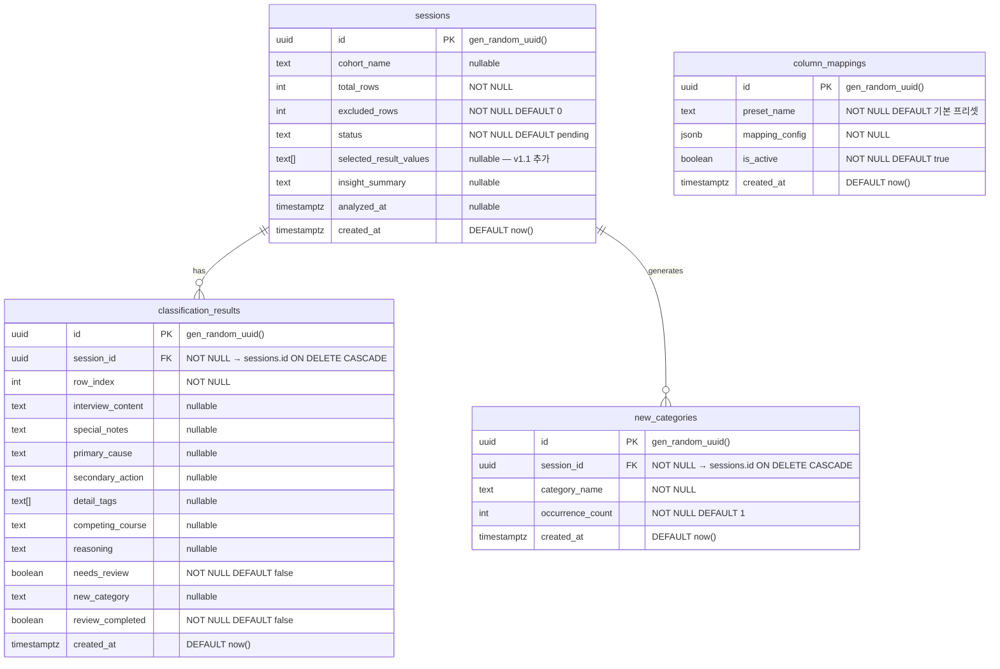

# 취소사유분석기 TRD — AI 입력용 핸드오프 팩

> 본문: `trd-취소사유분석기-20260521.md`
> 사용처: Claude Code 시스템 프롬프트, DevOps 환경 구성, 외주 RFP 상세 첨부
> 성격: 정밀 데이터 카탈로그. 처음부터 끝까지 읽는 용도가 아니다. 필요한 섹션을 부분 참조한다.

---

## 1. 잠긴 결정 (Locked Decisions)

- **아키텍처**: 모듈러 모놀로식 (upload / classify / result / dashboard / shared)
- **프레임워크**: Next.js 14 App Router (TypeScript strict)
- **UI**: Tailwind CSS + shadcn/ui
- **검증**: Zod (단독, React Hook Form 없음)
- **파일 파싱**: SheetJS — **클라이언트(브라우저) 전용** (서버 업로드 없음)
- **노션 출력**: `generateNotionMarkdown()` — **클라이언트 전용** (Route Handler 불필요)
- **API 방식**: REST (Route Handler 10개)
- **OpenAI 연결**: openai npm SDK, Route Handler 전용
- **DB 클라이언트**: @supabase/ssr — `shared/supabase/server.ts` 단일 파일, `server-only` 패키지 적용
- **DB 접근 키**: **Service Role Key만 사용** (Anon Key는 코드에 사용하지 않음)
- **ORM**: 없음 (Supabase 클라이언트 직접)
- **캐시**: 없음 (v1)
- **상태 관리**: useState 로컬 상태 (전역 상태 관리 없음)
- **세션 감지**: localStorage `session_id` + Supabase `sessions.status` 조회
- **인증**: 없음 (v1 — 채매니저 단독 URL 직접 접근)
- **호스팅**: Vercel Hobby 무료 플랜
- **도메인**: vercel.app 기본 URL (v1)
- **CI/CD**: Vercel 자동 배포 (GitHub main 브랜치 연동)
- **Cron Job**: Vercel Cron `/api/ping` 매일 09:00 KST (Supabase 자동 정지 차단)
- **에러 추적**: Vercel 내장 함수 로그
- **Supabase 환경 분리**: 개발·운영 2개 프로젝트 분리
- **모델명 관리**: 환경 변수 `OPENAI_MODEL` (코드 하드코딩 금지)
- **재시도 전략**: 1.5초 대기 후 1회 재시도 → 실패 시 `needs_review=true`
- **Vercel 함수 타임아웃**: 9초 설정 (`maxDuration: 9`)
- **v2 준비**: `dashboard_tokens` 테이블 SQL 주석 보존 (코드 변경 없음)

---

## 2. package.json 핵심 의존성

```json
{
  "dependencies": {
    "next": "^14.2.0",
    "react": "^18.3.0",
    "react-dom": "^18.3.0",
    "@supabase/ssr": "^0.5.0",
    "@supabase/supabase-js": "^2.43.0",
    "openai": "^4.52.0",
    "server-only": "^0.0.1",
    "zod": "^3.23.0",
    "xlsx": "^0.18.5",
    "recharts": "^2.12.0",
    "tailwindcss": "^3.4.0",
    "class-variance-authority": "^0.7.0",
    "clsx": "^2.1.0",
    "tailwind-merge": "^2.3.0",
    "lucide-react": "^0.400.0"
  },
  "devDependencies": {
    "typescript": "^5.4.0",
    "@types/node": "^20.0.0",
    "@types/react": "^18.3.0",
    "@types/react-dom": "^18.3.0",
    "eslint": "^8.57.0",
    "eslint-config-next": "^14.2.0",
    "supabase": "^1.170.0"
  },
  "scripts": {
    "dev": "next dev",
    "build": "next build",
    "start": "next start",
    "db:types": "supabase gen types typescript --project-id [운영_PROJECT_ID] > shared/types/database.types.ts"
  }
}
```

> `shadcn/ui` 컴포넌트는 `npx shadcn-ui@latest add [컴포넌트명]`으로 프로젝트에 복사 설치. 필요 컴포넌트: button, select, checkbox, dialog, toast, progress, badge, table, input, label, separator, tabs

---

## 3. 데이터베이스 (정밀)

### 3.1 ERD (상세)



### 3.2 CREATE TABLE 전문 (PRD v1.1 기준)

```sql
-- 분류 세션 (기수 단위)
CREATE TABLE sessions (
  id                      uuid DEFAULT gen_random_uuid() PRIMARY KEY,
  cohort_name             text,
  total_rows              int NOT NULL,
  excluded_rows           int NOT NULL DEFAULT 0,
  status                  text NOT NULL DEFAULT 'pending',
  -- status: pending | analyzing | insight_generating | completed | failed
  selected_result_values  text[],
  insight_summary         text,
  analyzed_at             timestamptz,
  created_at              timestamptz DEFAULT now()
);

-- 행별 분류 결과
CREATE TABLE classification_results (
  id                  uuid DEFAULT gen_random_uuid() PRIMARY KEY,
  session_id          uuid NOT NULL REFERENCES sessions(id) ON DELETE CASCADE,
  row_index           int NOT NULL,
  interview_content   text,
  special_notes       text,
  primary_cause       text,
  secondary_action    text,
  detail_tags         text[],
  competing_course    text,
  reasoning           text,
  needs_review        boolean NOT NULL DEFAULT false,
  new_category        text,
  review_completed    boolean NOT NULL DEFAULT false,
  created_at          timestamptz DEFAULT now()
);

-- 컬럼 매핑 프리셋
-- mapping_config 구조: {"interview": "컬럼명", "notes": "컬럼명", "result": "컬럼명", "source": "컬럼명 또는 null"}
CREATE TABLE column_mappings (
  id              uuid DEFAULT gen_random_uuid() PRIMARY KEY,
  preset_name     text NOT NULL DEFAULT '기본 프리셋',
  mapping_config  jsonb NOT NULL,
  is_active       boolean NOT NULL DEFAULT true,
  created_at      timestamptz DEFAULT now()
);

-- 신규 카테고리 누적
CREATE TABLE new_categories (
  id               uuid DEFAULT gen_random_uuid() PRIMARY KEY,
  session_id       uuid NOT NULL REFERENCES sessions(id) ON DELETE CASCADE,
  category_name    text NOT NULL,
  occurrence_count int NOT NULL DEFAULT 1,
  created_at       timestamptz DEFAULT now()
);

-- v2 고도화 항목 — v1에서 미사용 (주석 보존)
-- CREATE TABLE dashboard_tokens (
--   id          uuid DEFAULT gen_random_uuid() PRIMARY KEY,
--   session_id  uuid NOT NULL REFERENCES sessions(id) ON DELETE CASCADE,
--   token       text NOT NULL UNIQUE,
--   created_at  timestamptz DEFAULT now()
-- );
```

### 3.3 RLS 정책

```sql
-- sessions: 읽기/쓰기 모두 허용 (사내 도구, 별도 인증 없음)
ALTER TABLE sessions ENABLE ROW LEVEL SECURITY;
CREATE POLICY "allow_all_sessions" ON sessions FOR ALL USING (true);

ALTER TABLE classification_results ENABLE ROW LEVEL SECURITY;
CREATE POLICY "allow_all_results" ON classification_results FOR ALL USING (true);

ALTER TABLE column_mappings ENABLE ROW LEVEL SECURITY;
CREATE POLICY "allow_all_mappings" ON column_mappings FOR ALL USING (true);

ALTER TABLE new_categories ENABLE ROW LEVEL SECURITY;
CREATE POLICY "allow_all_categories" ON new_categories FOR ALL USING (true);

-- v2 구현 시 추가
-- ALTER TABLE dashboard_tokens ENABLE ROW LEVEL SECURITY;
-- CREATE POLICY "allow_all_tokens" ON dashboard_tokens FOR ALL USING (true);
```

### 3.4 인덱스

```sql
CREATE INDEX idx_classification_results_session_id
  ON classification_results(session_id);

CREATE INDEX idx_classification_results_needs_review
  ON classification_results(session_id, needs_review)
  WHERE needs_review = true;

CREATE INDEX idx_new_categories_session_id
  ON new_categories(session_id);

-- v2에서 dashboard_tokens 생성 시 추가
-- CREATE INDEX idx_dashboard_tokens_token ON dashboard_tokens(token);
```

### 3.5 shared/supabase/server.ts

```typescript
import 'server-only'
import { createServerClient } from '@supabase/ssr'
import { cookies } from 'next/headers'
import type { Database } from '@/shared/types/database.types'

export function createClient() {
  const cookieStore = cookies()
  return createServerClient<Database>(
    process.env.SUPABASE_URL!,
    process.env.SUPABASE_SERVICE_ROLE_KEY!,  // Service Role Key — RLS 우회
    {
      cookies: {
        getAll() { return cookieStore.getAll() },
        setAll(cookiesToSet) {
          try {
            cookiesToSet.forEach(({ name, value, options }) =>
              cookieStore.set(name, value, options)
            )
          } catch {}
        },
      },
    }
  )
}
```

> `NEXT_PUBLIC_` 접두사 없는 변수는 서버에서만 읽힘. 클라이언트 컴포넌트에서 이 파일을 import하면 `server-only` 패키지가 빌드 타임 에러를 발생시킴.

---

## 4. 보안 정책 상세

### 4.1 API 키 접근 제어

| 환경 변수 | 노출 범위 | 이유 |
|---|---|---|
| `OPENAI_API_KEY` | 서버(Route Handler)만 | 브라우저 노출 시 무단 GPT 호출 가능 |
| `OPENAI_MODEL` | 서버(Route Handler)만 | 모델명은 민감 정보 아니나 일관성 |
| `SUPABASE_URL` | 서버(Route Handler)만 | Service Role Key와 세트 |
| `SUPABASE_ANON_KEY` | **사용 안 함** | Service Role Key로 대체 |
| `SUPABASE_SERVICE_ROLE_KEY` | 서버(Route Handler)만 | DB 전체 접근 권한 — 절대 노출 금지 |

### 4.2 클라이언트 ↔ 서버 경계 규칙

```
[허용] 클라이언트 → POST /api/classify → Route Handler → OpenAI / Supabase
[금지] 클라이언트 → Supabase 직접 호출 (Service Role Key 노출 위험)
[허용] 클라이언트 → SheetJS 파싱 (파일 서버 전송 없음)
[허용] 클라이언트 → generateNotionMarkdown() (순수 텍스트 변환)
```

`shared/supabase/server.ts`에 `server-only` 패키지 적용으로 위반 시 빌드 에러 발생.

### 4.3 세션 보안

- `localStorage` `session_id`가 없거나 DB status가 'analyzing' 미만이면 S-001로 리다이렉트
- `classifying=true` localStorage 키로 다중탭 동시 실행 차단 (같은 브라우저 한정)
- Private Mode(시크릿 창) 사용 시 세션 감지 불가 — README에 경고 문구 추가

---

## 5. 환경변수 목록 (.env.example)

```bash
# ===== OpenAI =====
OPENAI_API_KEY=sk-...
OPENAI_MODEL=gpt-5.5-2026-04-23
# 모델 deprecated 시 Vercel 대시보드에서 값만 수정 (재배포 불필요)

# ===== Supabase =====
SUPABASE_URL=https://[프로젝트ID].supabase.co
SUPABASE_SERVICE_ROLE_KEY=eyJ...
# Anon Key는 사용하지 않음

# 개발 환경용 별도 값 (Vercel Preview/Development 환경에 설정)
# SUPABASE_URL=https://[개발_프로젝트ID].supabase.co
# SUPABASE_SERVICE_ROLE_KEY=eyJ...개발용...
```

> Vercel 대시보드 > Settings > Environment Variables에서 등록.
> `OPENAI_API_KEY`, `SUPABASE_SERVICE_ROLE_KEY`는 "Sensitive" 체크 필수.
> Production 환경: 운영 Supabase 프로젝트 값
> Preview/Development 환경: 개발 Supabase 프로젝트 값

---

## 6. 외부 서비스 가입·설정 가이드

### 6.1 OpenAI

- 가입: platform.openai.com
- API 키 발급: API Keys > Create new secret key
- 사용 모델: `gpt-5.5-2026-04-23` (response_format: json_object 지원 확인 필수)
- 비용 모니터링: Usage > 프로젝트별 필터로 기수당 실제 비용 측정
- Rate Limit: Tier 1 기준 분당 500 RPM — 3건 묶음 순차 호출이므로 동시 요청 없음. 초과 위험 낮음
- 핵심 환경변수: `OPENAI_API_KEY`, `OPENAI_MODEL`

### 6.2 Supabase (2개 프로젝트)

- 가입: supabase.com
- **운영 프로젝트** 생성: 프로젝트명 `cancel-analyzer-prod`
  - Settings > API > Project URL → `SUPABASE_URL` (운영)
  - Settings > API > service_role key → `SUPABASE_SERVICE_ROLE_KEY` (운영)
- **개발 프로젝트** 생성: 프로젝트명 `cancel-analyzer-dev`
  - 동일하게 URL·service_role key 추출 → Vercel Preview/Development 환경에 등록
- SQL 에디터에서 §3.2 CREATE TABLE → §3.3 RLS → §3.4 인덱스 순서로 실행
- 타입 생성: `npm run db:types` (운영 프로젝트 ID 기준)
- 무료 플랜 한도: 저장 500MB / 월 API 50만 회 — 수천 기수 처리해도 초과 없음

### 6.3 Vercel

- 가입: vercel.com
- GitHub 저장소 연결 → New Project > Import
- Framework: Next.js (자동 감지)
- Environment Variables: §5 목록 그대로 등록
  - Production: 운영 Supabase 값
  - Preview + Development: 개발 Supabase 값
- Cron Job: `vercel.json` 설정 후 자동 활성 (§7.2 참조)

---

## 7. 배포 (CI/CD)

### 7.1 배포 흐름

```
[개발자 로컬] npm run dev → localhost:3000 (개발 Supabase)
     ↓ git push (main 외 브랜치)
[Vercel Preview] 임시 URL 자동 생성 → 테스트 및 확인
     ↓ git merge → main
[Vercel Production] 프로젝트명.vercel.app → 채매니저 사용
```

별도 GitHub Actions yaml 불필요. Vercel이 push 감지 후 자동 빌드·배포.

### 7.2 vercel.json

```json
{
  "crons": [
    {
      "path": "/api/ping",
      "schedule": "0 0 * * *"
    }
  ],
  "functions": {
    "app/api/classify/route.ts": {
      "maxDuration": 9
    },
    "app/api/column-detect/route.ts": {
      "maxDuration": 9
    },
    "app/api/insight/route.ts": {
      "maxDuration": 9
    }
  }
}
```

> Cron `"0 0 * * *"` = 매일 UTC 00:00 (KST 09:00) 실행.
> `maxDuration: 9` = 9초 타임아웃 (Vercel Hobby 최대 10초에서 1초 여유).

### 7.3 /api/ping Route Handler

```typescript
// app/api/ping/route.ts
import { NextResponse } from 'next/server'
import { createClient } from '@/shared/supabase/server'

export async function GET() {
  try {
    const supabase = createClient()
    await supabase.from('sessions').select('id').limit(1)
    return NextResponse.json({ ok: true, at: new Date().toISOString() })
  } catch (error) {
    return NextResponse.json({ ok: false }, { status: 500 })
  }
}
```

### 7.4 Route Handler 전체 목록

| Route | 파일 경로 | 메서드 | 역할 | 연결 기능 |
|---|---|---|---|---|
| /api/ping | app/api/ping/route.ts | GET | Supabase keep-alive (Cron 전용) | — |
| /api/sessions | app/api/sessions/route.ts | POST | 신규 세션 생성 | F-010 |
| /api/sessions/[id] | app/api/sessions/[id]/route.ts | GET | 세션 상태 조회 | E-016 |
| /api/sessions/[id] | app/api/sessions/[id]/route.ts | PATCH | 세션 상태 업데이트 | F-015 |
| /api/classify | app/api/classify/route.ts | POST | GPT-5.5 3건 분류 + DB 저장 | F-011~F-015 |
| /api/column-detect | app/api/column-detect/route.ts | POST | GPT-5.5 컬럼 자동 감지 | F-006 |
| /api/insight | app/api/insight/route.ts | POST | GPT-5.5 인사이트 요약 생성 | F-012, F-034 |
| /api/results/[id] | app/api/results/[id]/route.ts | PATCH | 인라인 수정 저장 (4개 항목) | F-020 |
| /api/presets | app/api/presets/route.ts | GET | 프리셋 목록 조회 | F-005 |
| /api/presets | app/api/presets/route.ts | POST | 프리셋 저장 | F-005 |
| /api/presets/[id] | app/api/presets/[id]/route.ts | DELETE | 프리셋 삭제 | F-005 |

### 7.5 프로젝트 폴더 구조

```
취소사유분석기/
├── app/
│   ├── upload/
│   │   └── page.tsx              # S-001 Client Component — SheetJS 파싱
│   ├── analyzing/
│   │   └── page.tsx              # S-002 Client Component — 분류 루프
│   ├── result/
│   │   └── page.tsx              # S-003 Client Component — generateNotionMarkdown()
│   ├── dashboard/
│   │   └── page.tsx              # S-004 Client Component — Recharts
│   └── api/
│       ├── ping/route.ts
│       ├── sessions/
│       │   ├── route.ts
│       │   └── [id]/route.ts
│       ├── classify/route.ts     # maxDuration: 9
│       ├── column-detect/route.ts
│       ├── insight/route.ts
│       ├── results/[id]/route.ts
│       └── presets/
│           ├── route.ts
│           └── [id]/route.ts
├── shared/
│   ├── supabase/
│   │   └── server.ts             # server-only, Service Role Key
│   └── types/
│       └── database.types.ts     # npm run db:types 자동 생성
├── vercel.json
├── tsconfig.json                 # strict: true
└── README.md
```

### 7.6 Vercel 환경변수 설정 체크리스트

```
Production 환경:
□ OPENAI_API_KEY          (Sensitive 체크)
□ OPENAI_MODEL            = gpt-5.5-2026-04-23
□ SUPABASE_URL            = 운영 프로젝트 URL
□ SUPABASE_SERVICE_ROLE_KEY (Sensitive 체크)

Preview + Development 환경:
□ SUPABASE_URL            = 개발 프로젝트 URL
□ SUPABASE_SERVICE_ROLE_KEY = 개발 프로젝트 키
□ OPENAI_API_KEY          (동일 또는 별도 개발용 키)
□ OPENAI_MODEL            = gpt-5.5-2026-04-23
```

---

## 8. 모니터링·로깅

| 항목 | 도구 | 접근 경로 | 확인 시점 |
|---|---|---|---|
| Route Handler 오류 | Vercel 내장 로그 | Vercel 대시보드 > Functions | 채매니저 오류 신고 시 |
| DB 오류 | Supabase 내장 로그 | Supabase 대시보드 > Logs > API | 분류 결과 이상 시 |
| GPT 사용량·비용 | OpenAI 대시보드 | platform.openai.com > Usage | 기수 분류 완료 후 |
| 빌드 오류 | Vercel 배포 로그 | Vercel 대시보드 > Deployments | 코드 push 후 |
| Cron 실행 결과 | Vercel Cron 로그 | Vercel 대시보드 > Cron Jobs | 주 1회 확인 권장 |

---

## 9. NFR 정밀 수치 (PRD v1.1 §5 기준)

| 항목 | 요구사항 | 측정 방법 | 실패 시 처리 |
|---|---|---|---|
| 분류 완료 시간 | 50건 기준 5분 이내 | 분류 실행 클릭 ~ /result 도달 실측 | 개선 필요 시 배치 크기 조정 |
| API 비용 | 기수당 $0.50 이하 | OpenAI 대시보드 기수별 필터 | 초과 시 3건 → 5건 배치 검토 |
| Vercel 함수 실행 | 요청당 9초 이내 | maxDuration: 9 설정 | 초과 시 해당 3건 needs_review=true |
| 파일 크기 | 10MB 이하, 최대 200행 | 클라이언트 업로드 사전 검증 | F-009 안내 메시지 |
| API 키 노출 | 브라우저 미노출 | DevTools Network 탭 확인 | server-only 빌드 에러로 사전 차단 |
| 업로드·분류 화면 | 노트북 1024px 이상 전용 | Chrome 1024px 뷰포트 테스트 | 모바일 최적화 v2 |

---

## 10. 마이그레이션 경로 (벤더 락인 해소)

| 서비스 | 전환 트리거 | 전환 대상 | 작업량 |
|---|---|---|---|
| Vercel → 자체 서버 | 월 비용 $50+ or 함수 제한 초과 | Railway, Fly.io, AWS EC2 | `next start` 설정 + Dockerfile 1일 |
| Vercel → 별도 백엔드 | 분류 처리량 급증 | FastAPI + Celery (Python AI 서버 분리) | 2~4주 |
| Supabase → RDS | 저장 500MB 초과 or Pro 이상 비용 부담 | AWS RDS PostgreSQL | `pg_dump` 이관, RLS → 앱 레벨 권한 검사 재구현 2주 |
| OpenAI → 대안 모델 | 모델 deprecated or 비용 급증 | Claude API, Gemini API | 프롬프트 재검증 1~2주, OPENAI_MODEL 환경변수 교체 |
| SheetJS → 대안 | 라이브러리 지원 종료 | ExcelJS | upload 모듈 파싱 코드만 교체 0.5일 |

---

## 11. AI 바이브코딩 호환성 체크

- [x] 아키텍처 모듈 분해 명확 (5개 모듈 + 10개 Route Handler 경로 포함)
- [x] SheetJS 위치 명확 (클라이언트 전용)
- [x] 노션 출력 위치 명확 (클라이언트 전용, Route Handler 불필요)
- [x] Supabase 클라이언트 위치 명확 (shared/supabase/server.ts, server-only)
- [x] DB 스키마 SQL 완전 포함 (§3.2 — Supabase 직접 실행 가능)
- [x] RLS 정책 SQL 포함 (§3.3)
- [x] 인덱스 SQL 포함 (§3.4)
- [x] 환경변수 전체 목록 포함 (§5 — .env.example 형식)
- [x] 외부 서비스 가입 가이드 포함 (§6)
- [x] vercel.json 전문 포함 (§7.2 — Cron + maxDuration)
- [x] /api/ping Route Handler 코드 포함 (§7.3)
- [x] 폴더 구조 명시 (§7.5)
- [x] Vercel 환경변수 체크리스트 포함 (§7.6)
- [x] NFR 수치 포함 (§9 — PRD v1.1 기준)
- [x] 재시도 전략 명확 (1.5초 대기 후 1회)
- [x] v2 주석 보존 (dashboard_tokens — §3.2)

---

## 12. 다음 스킬 호출

**다음 단계**: brand-strategy
**호출 방법**: `"브랜드 전략 수립해줘"`
**brand-strategy에 제공할 입력 (총 6개 파일)**:
1. `prd-취소사유분석기-20260519.md` (PRD 본문)
2. `prd-취소사유분석기-20260519-handoff.md` (PRD 핸드오프 v1.1)
3. `frd-취소사유분석기-20260519.md` (FRD 본문)
4. `frd-취소사유분석기-20260519-handoff.md` (FRD 핸드오프)
5. `trd-취소사유분석기-20260521.md` (TRD 본문 — 본 파일 참조)
6. 본 핸드오프 파일 `trd-취소사유분석기-20260521-handoff.md`
