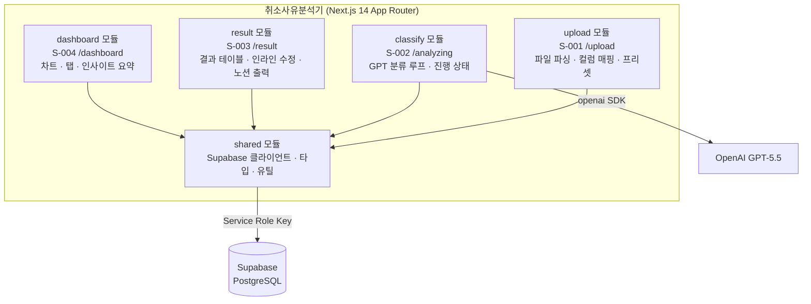
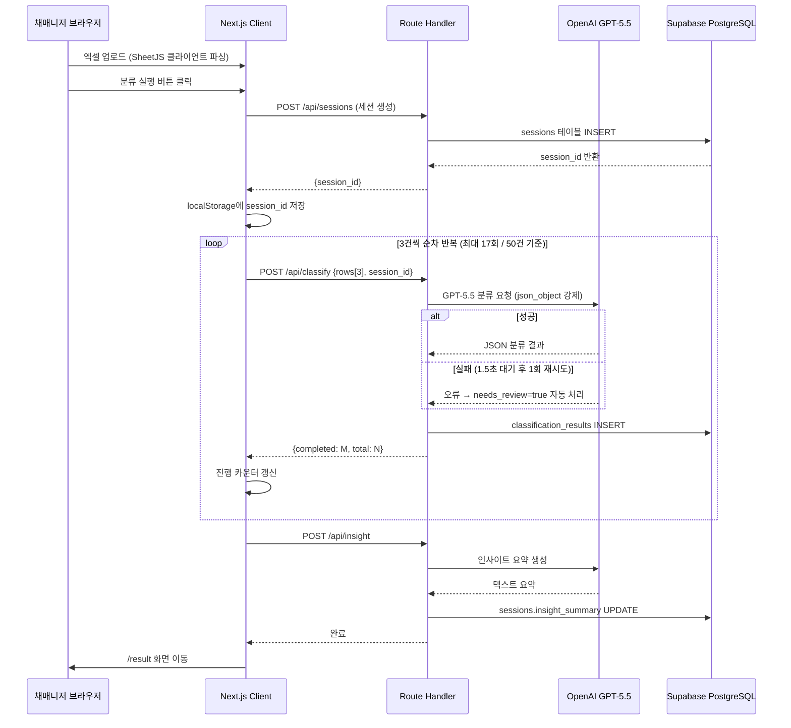
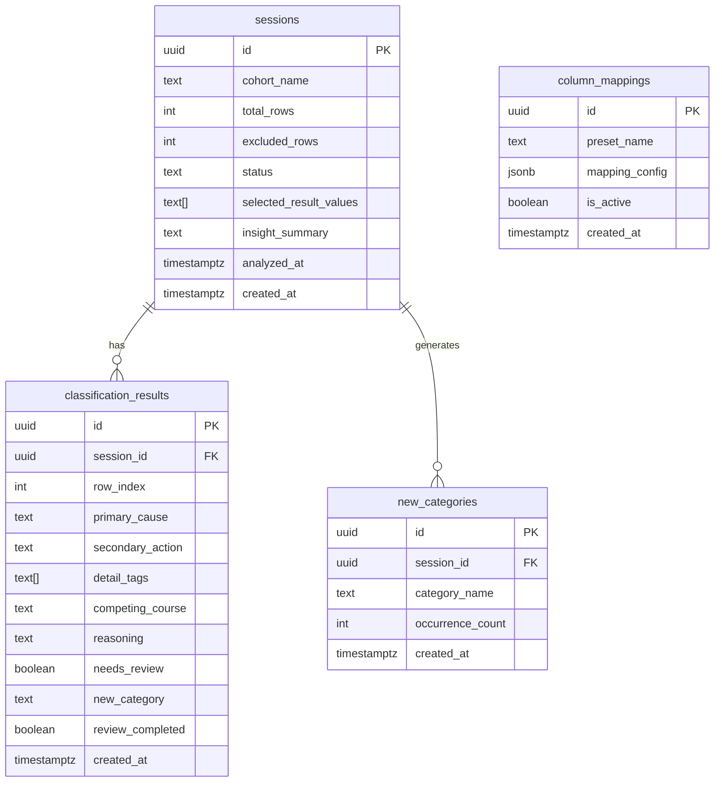

# 취소사유분석기 TRD

> 작성일: 2026-05-21 · 버전: v1.0
> PRD: `prd-취소사유분석기-20260519.md` v1.1
> FRD: `frd-취소사유분석기-20260519.md` v1.0
> 다음 단계: 브랜드 전략 (`trd-취소사유분석기-20260521-handoff.md` 참조)

---

## 1. 한 문단 요약

취소사유분석기는 채매니저 1인이 기수(cohort)별 취소자 데이터를 엑셀로 업로드하고, GPT-5.5가 취소 사유를 자동 분류한 뒤 대시보드로 시각화하는 사내 도구입니다. 전체 시스템은 Next.js 14 App Router 단일 프로젝트 안에 업로드·분류·결과·대시보드 4개 모듈을 폴더로 분리한 **모듈러 모놀로식** 구조로 구성됩니다. 별도 서버 없이 Vercel에서 서버리스 함수로 동작하고, Supabase(PostgreSQL)가 분류 결과를 영구 저장합니다. 프론트엔드와 백엔드가 TypeScript 한 언어를 공유하므로 타입 오류를 빌드 타임에 잡을 수 있고, AI 개발 도구(Claude Code)가 이 조합에서 가장 정확한 코드를 생성합니다.

v1 운영비는 **월 $0**입니다(Vercel Hobby 무료, Supabase 무료, 패키지 전부 오픈소스). OpenAI API 사용료는 기수당 $0.05~0.15(추정)로, PRD NFR "$0.50 이하"를 여유 있게 만족합니다. 가장 큰 기술 리스크는 두 가지입니다. 첫째, Supabase 무료 플랜이 7일 비활성 시 자동 정지되는 문제로, Vercel Cron Job으로 매일 ping을 보내 방지합니다. 둘째, GPT-5.5 모델 deprecated 시 서비스 중단 위험으로, 모델명을 환경 변수로 분리해 코드 재배포 없이 교체할 수 있게 했습니다.

---

## 2. 어떤 그림으로 만드는가 (아키텍처)

취소사유분석기의 전체 구조는 Next.js 14 프로젝트 하나가 프론트엔드와 백엔드를 모두 담당하는 **풀스택 단일 프로젝트**입니다. 사용자가 보는 화면(Client Component)과 OpenAI·Supabase를 호출하는 서버 코드(Route Handler)가 같은 GitHub 저장소 안에 있어, Vercel에서 `git push` 한 번으로 전체를 배포합니다.

### 2.1 아키텍처 결정 — 모듈러 모놀로식

채매니저 1인이 사내에서 단독으로 쓰는 도구를 MSA(Microservices Architecture — 기능을 독립 서버 10개 이상으로 쪼개는 구조)로 만들면 운영 부담이 개발 부담을 넘어섭니다. 서버 10개를 각각 배포·모니터링·장애 대응해야 하기 때문입니다. 반대로 코드를 구조 없이 하나의 파일 더미로 쌓으면 나중에 기능을 추가하거나 수정할 때 어디를 바꿔야 하는지 파악하기 어렵습니다.

**모듈러 모놀로식(Modular Monolith)**은 두 극단의 중간입니다. 한 프로젝트 안에 두되, 기능별로 폴더(모듈)를 명확히 나눠 서로 직접 의존하지 않게 경계를 잡습니다. 이 구조는 나중에 특정 모듈의 트래픽이 폭발적으로 늘면 해당 모듈만 꺼내 독립 서비스로 분리할 수 있는 출구를 미리 열어둡니다.

| 항목 | 모듈러 모놀로식 (선택) | MSA | 서버리스 단일 파일 |
|---|---|---|---|
| 초기 개발 속도 | 빠름 | 느림 (설정 1개월) | 빠름 |
| 운영 서버 수 | 1개 | 5~10개 | 1개 |
| 1인 운영 가능 여부 | ✅ | ❌ | ✅ |
| 모듈 간 경계 | 폴더로 분리 | 네트워크로 분리 | 없음 |
| 향후 MSA 전환 가능 | ✅ 모듈 단위 분리 | — | ❌ 어려움 |
| 월 비용 (v1) | $0 | $50~200 | $0 |

### 2.2 모듈 분해

4개 화면(S-001~S-004)이 곧 4개 모듈로 대응되고, 공통 코드는 `shared` 모듈로 집중합니다. 모듈 간 데이터는 Supabase를 통해 간접 공유하며, 직접 import는 `shared`를 경유할 때만 허용합니다.



### 2.3 모듈 간 통신

모듈끼리 직접 함수를 호출하지 않습니다. 업로드 모듈이 세션을 생성하면 Supabase에 저장하고, 분류 모듈이 같은 세션 ID로 결과를 저장합니다. 화면 간 상태 전달은 `localStorage`에 `session_id`를 보관하는 방식으로 처리합니다. 이렇게 하면 어느 한 모듈이 느려지거나 오류가 나도 다른 모듈의 코드를 수정할 필요가 없습니다.

---

## 3. 어떤 도구로 만드는가 (기술 스택)

프론트엔드·백엔드·DB·인프라·외부 서비스 순서로 각 영역의 결정과 이유를 설명합니다. 모든 결정에 월 비용과 마이그레이션 난이도를 함께 기재합니다.

### 3.1 프론트엔드

Next.js 14 App Router는 PRD에서 이미 확정된 프레임워크입니다. 여기에 **TypeScript strict 모드**, **Tailwind CSS**, **shadcn/ui**, **Zod** 네 가지를 추가합니다.

📚 **미니 강의**: TypeScript(타입스크립트)는 JavaScript에 "이 변수는 반드시 문자열이어야 한다"는 메모를 붙이는 언어입니다. GPT-5.5 응답 JSON을 파싱해 DB에 저장하는 이 서비스에서 타입 메모가 없으면 "GPT가 null을 반환했는데 코드는 문자열인 줄 알고 처리하다 폭발"하는 상황이 생깁니다. strict 모드는 이 메모를 가장 꼼꼼하게 달도록 강제하며, AI 개발 도구가 strict 환경에서 더 정확한 코드를 생성합니다.

파일 파싱(SheetJS)은 **클라이언트(브라우저)** 에서 처리합니다. 엑셀 파일을 서버에 업로드하지 않고 브라우저 메모리에서 직접 JS 배열로 변환하므로 네트워크 비용이 없고 Vercel 함수 메모리 한도와 무관합니다. 노션 출력 마크다운 생성 역시 **클라이언트 전용** 로직으로, 분류 결과(React state)를 받아 텍스트를 생성 후 `navigator.clipboard.writeText()`로 복사합니다. Route Handler 호출이 필요 없습니다.

| 영역 | 선택 | 대안 | 선택 이유 |
|---|---|---|---|
| 프레임워크 | Next.js 14 App Router | Remix, SvelteKit | PRD 확정. AI 도구 호환 최고, Vercel 1클릭 |
| 언어 | TypeScript strict | JavaScript | GPT 응답 파싱 오류 빌드 타임 차단 |
| UI 컴포넌트 | shadcn/ui | MUI, Chakra | 코드 소유권, Tailwind 완전 호환, AI 인지도 높음 |
| 스타일링 | Tailwind CSS | CSS Modules | 조건부 클래스 1줄(`bg-yellow-50`), 파일 분리 없음 |
| 검증 | Zod (단독) | React Hook Form + Zod | 드롭다운·버튼 활성 패턴에 폼 라이브러리 불필요 |
| 파일 파싱 | SheetJS (클라이언트) | 서버 업로드 + 파싱 | 네트워크 전송 없음, Vercel 메모리 무관 |

> 정밀한 버전 및 package.json 전문은 핸드오프 §2 참조.

### 3.2 백엔드

Next.js Route Handler가 백엔드 역할을 합니다. 별도 서버 없이 Vercel 서버리스 함수로 동작하므로 운영 부담이 없습니다. 프론트엔드와 TypeScript를 공유해 타입을 한 번만 선언하면 양쪽에서 재사용됩니다.

📚 **미니 강의**: Route Handler(라우트 핸들러)는 Next.js 프로젝트 안의 "서버 전용 API 파일"입니다. 브라우저는 이 파일을 볼 수 없고 서버에서만 실행됩니다. OpenAI API 키가 브라우저에 절대 노출되지 않아야 한다는 NFR을 이 구조가 보장합니다.

총 **10개 Route Handler**가 있습니다. 9개는 비즈니스 로직용이고, 1개(`/api/ping`)는 Supabase 무료 플랜 자동 정지를 막는 keep-alive 전용입니다.

| 영역 | 선택 | 대안 | 선택 이유 |
|---|---|---|---|
| 런타임 | Node.js (TypeScript) | Python, Go | 프론트와 동일 언어, 타입 공유 |
| API 방식 | REST (Route Handler 10개) | tRPC, GraphQL | 표준성, AI 도구 호환 최고 |
| OpenAI 연결 | openai npm SDK | fetch 직접 | 타입 내장, `response_format` 1줄 설정 |
| DB 접근 방식 | Supabase 클라이언트 직접 | Prisma ORM | 4개 테이블에 ORM 불필요, 타입 자동 생성 |
| 인증 | 없음 (v1) | NextAuth, Clerk | PRD 확정 — 채매니저 단독 사용 |

GPT-5.5 호출 실패 시: 1.5초 대기 후 1회 재시도 → 그래도 실패하면 해당 3건 `needs_review=true` 자동 처리. Vercel 타임아웃 9초 안에 안전하게 처리됩니다.

> Route Handler 파일 경로 목록·요청/응답 스펙은 핸드오프 §7 참조.

### 3.3 데이터베이스

Supabase(PostgreSQL)와 스키마 SQL은 PRD v1.1에서 완성되어 있습니다. ORM은 추가하지 않습니다. `@supabase/ssr` 클라이언트가 ORM처럼 동작하고, `supabase gen types` 명령어 한 번으로 4개 테이블 전체의 TypeScript 타입을 자동 생성합니다.

📚 **미니 강의**: Supabase는 "PostgreSQL DB + 웹 대시보드 + JavaScript 클라이언트"가 통합된 서비스입니다. 테이블 내용을 구글 스프레드시트처럼 브라우저에서 직접 볼 수 있고, SQL 에디터에서 쿼리를 실행할 수 있습니다. ORM(Object-Relational Mapping — DB를 코드처럼 다루는 번역기)이 없어도 Supabase 클라이언트 자체가 `.from('sessions').select('*').eq('id', sessionId)` 형태로 ORM과 유사하게 작동합니다.

| 영역 | 선택 | 대안 | 선택 이유 |
|---|---|---|---|
| DB | Supabase (PostgreSQL) | Neon, PlanetScale | PRD 확정. 무료 플랜 수년간 충분 |
| ORM | 없음 (Supabase 직접) | Prisma | 4개 테이블, 스키마 확정. Prisma는 과함 |
| 캐시 | 없음 (v1) | Upstash Redis | 1인·200행 규모에서 불필요 |
| 타입 생성 | supabase gen types | 수동 작성 | 스키마 변경 시 1개 명령어로 동기화 |
| 환경 분리 | 개발·운영 2개 프로젝트 | 단일 프로젝트 | 테스트 데이터 오염 방지 |

> CREATE TABLE 전문·RLS·인덱스는 핸드오프 §3 참조.

### 3.4 인프라

Vercel Hobby 무료 플랜에서 시작합니다. GitHub `main` 브랜치에 push하면 자동 배포되고, SSL 인증서와 CDN(콘텐츠 전송 네트워크 — 전 세계 서버에 분산 배포해 응답을 빠르게 하는 망)은 Vercel이 자동 처리합니다. 도메인은 `프로젝트명.vercel.app`으로 시작하며, v2에서 팀 공유 기능이 생기면 커스텀 도메인을 추가합니다.

**Supabase 자동 정지 대응**: Vercel Cron Job(매일 오전 9시 자동 실행되는 서버 함수)이 `/api/ping`을 호출해 Supabase에 더미 쿼리를 보냅니다. Vercel Hobby의 Cron 무료 한도(하루 1회 실행) 안에 들어오며, 이 방식으로 비활성 자동 정지를 완전히 차단합니다.

| 영역 | 선택 | 대안 | 비용 |
|---|---|---|---|
| 호스팅 | Vercel Hobby | Railway, Fly.io | $0 |
| 도메인 | vercel.app 기본 URL | Cloudflare Registrar | $0 (v1) |
| CI/CD | Vercel 자동 (GitHub 연동) | GitHub Actions | $0 |
| Cron Job | Vercel Cron (하루 1회) | 외부 서비스 | $0 |
| 에러 추적 | Vercel 내장 함수 로그 | Sentry | $0 |

> vercel.json 설정·배포 체크리스트는 핸드오프 §7 참조.

### 3.5 외부 서비스

결제·이메일·SMS는 v1 사내 도구 특성상 불필요합니다. OpenAI GPT-5.5만 핵심 외부 서비스입니다.

GPT-5.5 모델명(`gpt-5.5-2026-04-23`)은 코드에 하드코딩하지 않고 **환경 변수 `OPENAI_MODEL`** 로 분리합니다. 모델 deprecated 시 Vercel 대시보드에서 값만 수정하면 코드 변경·재배포 없이 즉시 교체됩니다.

| 서비스 | 용도 | 연동 방식 | 월 비용 |
|---|---|---|---|
| OpenAI GPT-5.5 | 분류·컬럼 감지·인사이트 요약 | openai SDK, Route Handler 전용 | 기수당 $0.05~0.15 추정 |
| Supabase | 5개 테이블 영구 저장 | @supabase/ssr, Service Role Key | $0 (무료 플랜) |
| Vercel | 호스팅·서버리스·Cron | GitHub 자동 연동 | $0 (Hobby) |

> 환경 변수 전체 목록·외부 서비스 가입 가이드는 핸드오프 §5·§6 참조.

---

## 4. 데이터가 어떻게 흐르는가

채매니저가 엑셀 파일을 업로드하고 분류 결과를 받기까지, 요청이 시스템을 어떻게 통과하는지 순서대로 설명합니다.

브라우저가 엑셀 파일을 SheetJS로 직접 파싱해 JS 배열을 만들고, 컬럼을 매핑한 뒤 분류 실행 버튼을 누르면 클라이언트가 루프를 시작합니다. 3건씩 묶어 `/api/classify`에 POST 요청을 보내고, Route Handler가 GPT-5.5를 호출해 결과를 Supabase에 저장하고 응답을 반환하면 클라이언트가 진행 카운터를 갱신합니다. 이 루프가 전체 행(최대 200건)을 처리할 때까지 반복됩니다.



### 4.1 데이터 모델 (개요)

4개 테이블이 sessions를 중심으로 연결됩니다. sessions 1개에 classification_results N개(행별 분류 결과)와 new_categories N개(AI가 생성한 신규 카테고리)가 달립니다. column_mappings는 독립 테이블로 프리셋 정보를 저장합니다.



> CREATE TABLE 전문·RLS 정책·인덱스는 핸드오프 §3 참조.

---

## 5. 안전을 어떻게 지키는가 (보안)

v1은 채매니저 단독 사용이므로 회원가입·로그인 인증이 없습니다. 그 대신 API 키 보호와 DB 접근 제어에 집중합니다.

### 5.1 인증·인가

v1에서는 URL을 직접 접근하는 방식으로 채매니저만 사용합니다. 세션 감지는 `localStorage`의 `session_id` 존재 여부와 Supabase의 `sessions.status` 값으로 처리합니다. S-002~S-004는 유효한 세션이 없으면 S-001로 리다이렉트합니다. v2에서 팀원 공유 기능(F-037~F-039)이 추가될 때 토큰 기반 읽기 전용 접근이 구현됩니다.

### 5.2 자격증명 저장

OpenAI API 키(`OPENAI_API_KEY`)와 Supabase Service Role Key(`SUPABASE_SERVICE_ROLE_KEY`)는 Vercel 환경 변수에만 저장하며 `NEXT_PUBLIC_` 접두사를 붙이지 않습니다. Next.js는 `NEXT_PUBLIC_`이 붙은 변수만 브라우저에 노출하므로, 접두사 없는 변수는 서버(Route Handler)에서만 읽힙니다. 모든 DB 접근은 `shared/supabase/server.ts` 단일 파일을 통해서만 이루어지며, 이 파일에 `server-only` 패키지를 import해 클라이언트 컴포넌트에서 실수로 호출하면 **빌드 타임 에러**가 발생하도록 강제합니다.

### 5.3 데이터 보호

Vercel과 Supabase는 모두 HTTPS를 기본 제공합니다. Supabase RLS(Row Level Security — 행 단위 접근 제어 정책)는 `FOR ALL USING (true)`로 설정되어 있으며, 실질적 방어선은 "모든 DB 접근이 Route Handler를 경유한다"는 구조 자체입니다. 채매니저가 직접 Supabase 대시보드에서 데이터를 열람·수정할 수 있으며, 자동 백업은 Supabase 무료 플랜에서 비활성 상태이므로 중요 기수 데이터는 노션 출력(F-023) 후 별도 보관을 권장합니다.

> RLS 정책 SQL·환경변수 목록·보안 체크리스트는 핸드오프 §4·§5 참조.

---

## 6. 얼마가 드는가 (비용·운영)

### 6.1 월 운영비 추정 (4단계)

| 단계 | 사용 규모 | 월 비용 추정 | 주요 비용 항목 |
|---|---|---|---|
| 개발/베타 | 개발자 1인 테스트 | **$0** | 없음 (전부 무료 플랜) |
| v1 출시 | 채매니저 1인, 월 수 기수 | **$0 + GPT 기수당 $0.15** | OpenAI API만 과금 |
| v1.x 확장 | 팀원 5인 이하 | **$0~25** | Supabase Pro 검토 시점 |
| v2 | 다중 사용자, 토큰 공유 | **$25~45** | Vercel Pro + Supabase Pro |

> OpenAI API 실제 비용은 첫 기수 분류 후 OpenAI 대시보드에서 실측 후 기록 권장.

### 6.2 운영 부담 (채매니저 기준)

일상 운영에서 채매니저가 할 일은 "엑셀 파일 업로드 → 분류 실행 → 결과 확인"뿐입니다. Vercel 자동 배포와 Supabase 관리 대시보드가 서버 운영 부담을 대신합니다. Supabase 자동 정지는 Vercel Cron Job이 차단하므로 별도 모니터링이 불필요합니다. 장애 발생 시 Vercel 대시보드 > Functions 탭에서 로그를 확인하거나, Supabase 대시보드 > Logs에서 DB 오류를 확인합니다.

### 6.3 3개월 출시 가능 여부

✅ **충분히 가능합니다.** 스택이 모두 확정되었고, PRD·FRD·TRD가 완성되었습니다. 4개 화면·40개 기능이 명세되어 있어 Claude Code에 직접 입력해 바이브코딩을 시작할 수 있습니다. DB 스키마가 이미 SQL로 완성되어 있어 초기 설정 시간이 최소화됩니다.

---

## 7. 무엇이 위험한가 (리스크·마이그레이션)

### 7.1 가장 큰 기술 리스크

- **GPT-5.5 모델 deprecated**: OpenAI가 `gpt-5.5-2026-04-23` 모델 지원을 종료하면 서비스 전체 분류 기능이 중단됩니다. → 모델명을 환경 변수 `OPENAI_MODEL`로 분리해 코드 재배포 없이 Vercel 대시보드에서 즉시 교체 가능하게 했습니다. OpenAI 모델 deprecated 공지를 모니터링하고, 공지 후 최소 1개월 안에 교체합니다.

- **Vercel Hobby 함수 타임아웃**: GPT-5.5 응답이 예외적으로 느려 9초를 초과하면 해당 3건이 `needs_review=true`로 처리됩니다. → 1.5초 재시도 1회를 포함해도 9초 안에 처리되도록 설계했으며, 부분 실패는 F-014 흐름으로 이미 처리됩니다. 전체 실패 시 F-015 재시도 버튼이 있습니다.

- **Supabase 스키마 변경 후 타입 불일치**: DB 컬럼을 추가하면 TypeScript 타입을 재생성(`npm run db:types`)해야 합니다. 잊으면 런타임 오류가 발생합니다. → `package.json`에 `db:types` 스크립트를 등록하고 README에 스키마 변경 체크리스트를 추가합니다.

### 7.2 벤더 락인과 마이그레이션 경로

이 서비스에서 가장 강하게 의존하는 외부 서비스는 OpenAI와 Supabase입니다. 두 서비스 모두 표준 인터페이스를 사용하므로 전환 난이도가 낮습니다.

| 서비스 | 의존 내용 | 전환 난이도 | 전환 시 주요 작업 |
|---|---|---|---|
| Vercel | 호스팅·Cron·서버리스 | 낮음 | `next start` + 서버 설정 (Railway·Fly.io) |
| Supabase | PostgreSQL + 클라이언트 | 낮음 | PostgreSQL 어디서나 작동. `pg_dump` 이관 |
| OpenAI GPT-5.5 | 분류·감지·요약 프롬프트 | 중간 | 프롬프트 재검증 필요. Claude·Gemini 대안 |
| SheetJS | 엑셀 파싱 (npm) | 낮음 | ExcelJS 등 대체 패키지로 교체 |
| Recharts | 차트 (npm) | 낮음 | 차트 컴포넌트만 교체 |

---

## 부록 A. 적대적 검토 결과 (R7 반영 완료)

```
━━━ 🔍 적대적 검토 ━━━
검토 관점: PM + Dev 양방향
검토 대상: 취소사유분석기 TRD v1.0

🔴 HIGH-1: Supabase 무료 플랜 7일 비활성 자동 정지
   → 수정안 B 채택: Vercel Cron Job /api/ping 매일 09:00 실행으로 차단

🔴 HIGH-2: SheetJS 처리 위치 미명시
   → 클라이언트 파싱으로 확정. app/upload/ Client Component에서 SheetJS 호출

🟡 MEDIUM-1: GPT-5.5 모델명 하드코딩 위험
   → OPENAI_MODEL 환경 변수 신설. 환경 변수 총 5개로 업데이트

🟡 MEDIUM-2: Supabase 접근 강제 장치 없음
   → shared/supabase/server.ts에 server-only 패키지 import. 빌드 타임 에러로 강제

🟡 MEDIUM-3: 노션 출력 로직 위치 미명시
   → 클라이언트 전용 확정. generateNotionMarkdown() 함수를 app/result/ Client Component에 구현

🟢 LOW-1: supabase gen types 자동화 미흡
   → package.json scripts에 db:types 추가. README 체크리스트 명시

🟢 LOW-2: localStorage 의존성 단일 장애점
   → 허용 (사내 도구 수준). README에 "일반 브라우저 사용 권장" 추가

━━━ 요약 ━━━
🔴 HIGH: 2건 → 모두 채택·반영 완료
🟡 MEDIUM: 3건 → 모두 채택·반영 완료
🟢 LOW: 2건 → 모두 채택·반영 완료
진행 판정: ✅ 진행 가능 (모든 HIGH 해소)
━━━━━━━━━━━━━━━━━
```
